---
## Front matter
title: "Отчет по лабораторной работе №1"
subtitle: "Установка и конфигурация операционной системы на виртуальную машину"
author: "Галацан Николай, НПИбд-01-22"

## Generic otions
lang: ru-RU
toc-title: "Содержание"

## Bibliography
bibliography: bib/cite.bib
csl: pandoc/csl/gost-r-7-0-5-2008-numeric.csl

## Pdf output format
toc: true # Table of contents
toc-depth: 2
lof: true # List of figures
fontsize: 12pt
linestretch: 1.5
papersize: a4
documentclass: scrreprt
## I18n polyglossia
polyglossia-lang:
  name: russian
  options:
	- spelling=modern
	- babelshorthands=true
polyglossia-otherlangs:
  name: english
## I18n babel
babel-lang: russian
babel-otherlangs: english
## Fonts
mainfont: PT Serif
romanfont: PT Serif
sansfont: PT Sans
monofont: PT Mono
mainfontoptions: Ligatures=TeX
romanfontoptions: Ligatures=TeX
sansfontoptions: Ligatures=TeX,Scale=MatchLowercase
monofontoptions: Scale=MatchLowercase,Scale=0.9
## Biblatex
biblatex: true
biblio-style: "gost-numeric"
biblatexoptions:
  - parentracker=true
  - backend=biber
  - hyperref=auto
  - language=auto
  - autolang=other*
  - citestyle=gost-numeric
## Pandoc-crossref LaTeX customization
figureTitle: "Рис."
tableTitle: "Таблица"
listingTitle: "Листинг"
lofTitle: "Список иллюстраций"
lolTitle: "Листинги"
## Misc options
indent: true
header-includes:
  - \usepackage{indentfirst}
  - \usepackage{float} # keep figures where there are in the text
  - \floatplacement{figure}{H} # keep figures where there are in the text
---

# Цель работы

Целью данной работы является приобретение практических навыков установки операционной системы на виртуальную машину, настройки минимально необходимых для дальнейшей работы сервисов.

# Выполнение лабораторной работы

В первую очередь скачиваю DVD-образ ОС с официального сайта 
(https://rockylinux.org/download). Приступаю к созданию виртуальной машины. Указываю имя виртуальной машины, выбираю тип ОС и версию, указываю путь к 
iso-образу, а также проверяю корректность пути для папки машины (рис. [-@fig:1]).

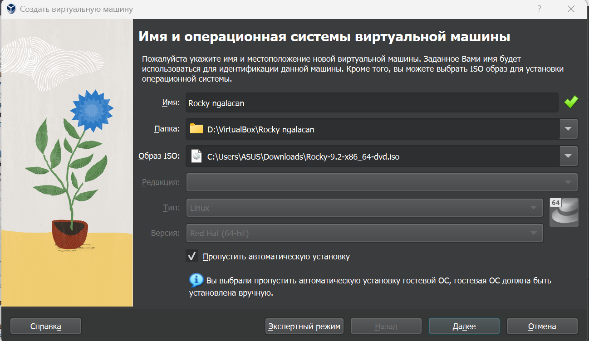{#fig:1 width=70%}

Указываю размер памяти и количество процессоров (рис. [-@fig:2])

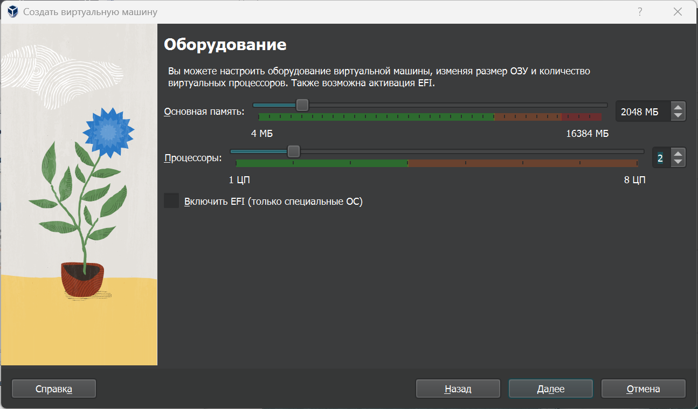{#fig:2 width=70%}

Задаю размер виртуального жесткого диска (40 ГБ) (рис. [-@fig:3])

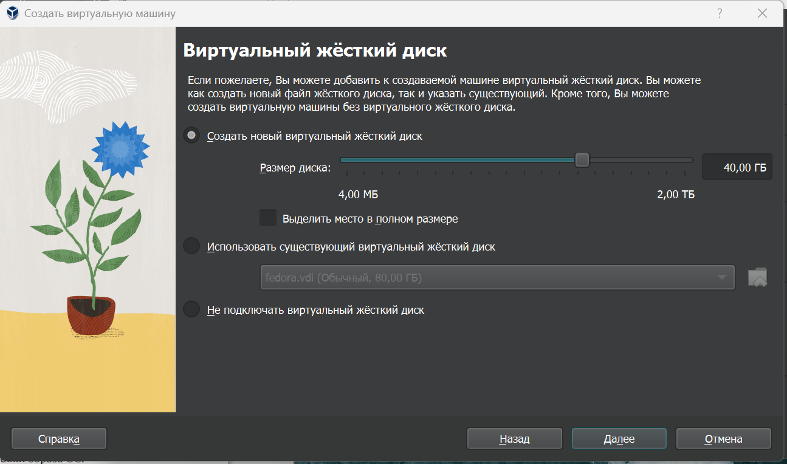{#fig:3 width=70%}

Запускаю виртуальную машину, устанавливаю образ ОС, перейдя на соответствующую строку (рис. [-@fig:4])

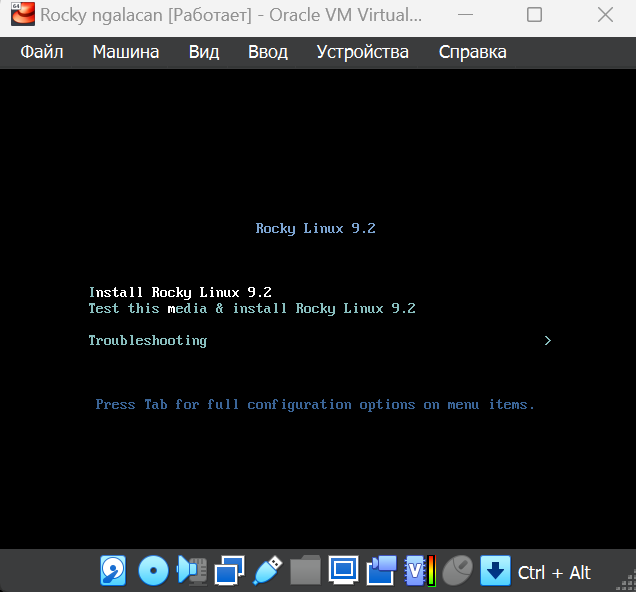{#fig:4 width=70%}

Произвожу необходимые настройки: устанавливаю язык интерфейса (рис. [-@fig:5] ), в окне 
настройки установки образа ОС вношу соответствующие инструкции корректировки 
(рис. [-@fig:6]). Настраиваю раскладку клавиатуры, раздел выбора программ (рис. [-@fig:7]).
Произвожу отключение KDUMP.

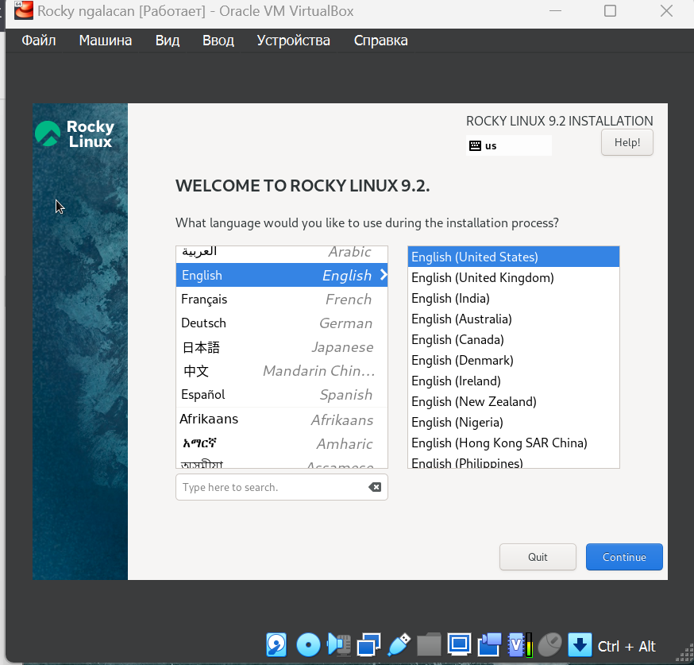{#fig:5 width=70%}

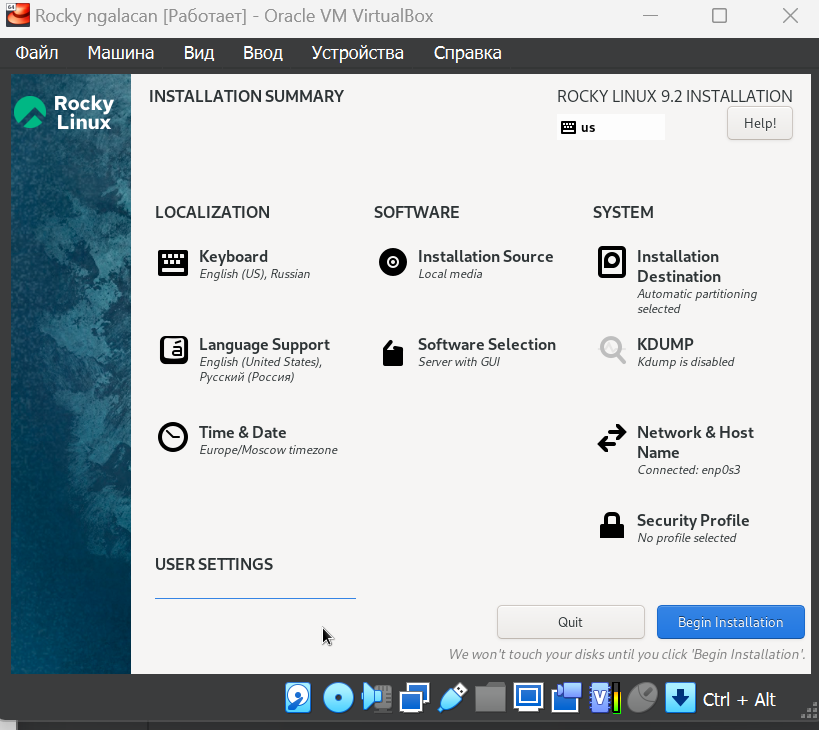{#fig:6 width=70%}

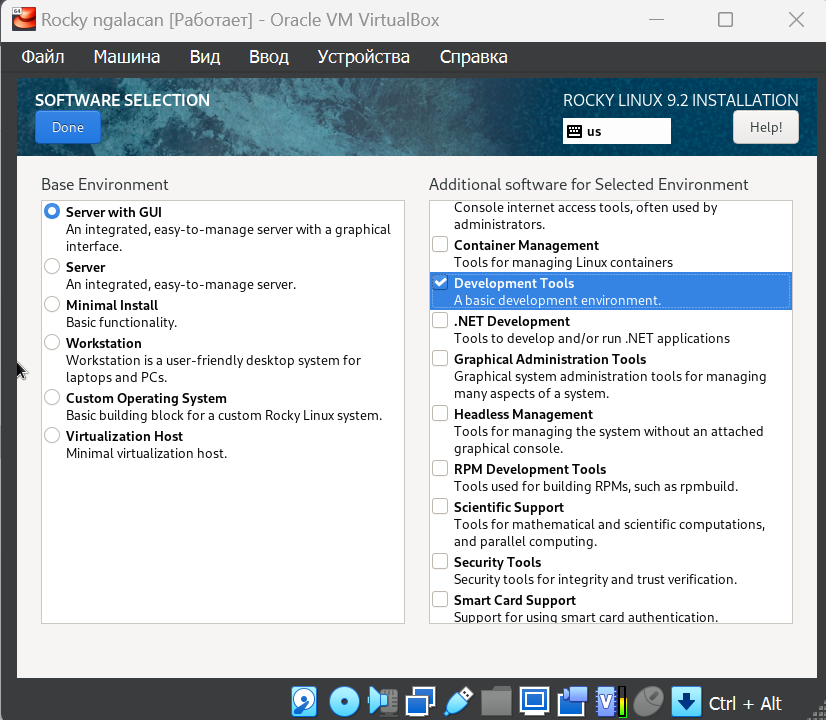{#fig:7 width=70%}

Проверяю место установки ОС (рис. [-@fig:8]).

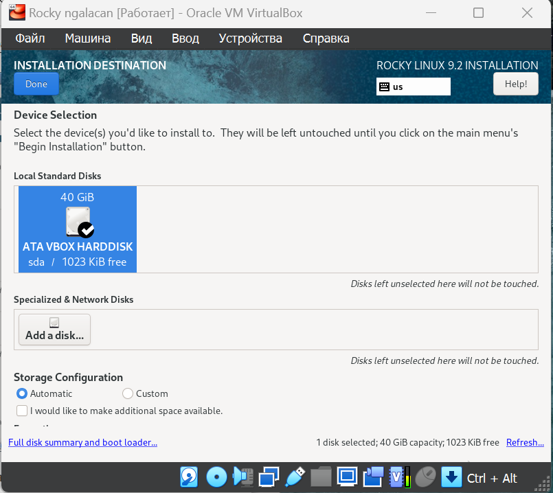{#fig:8 width=70%}

Произвожу настройку сетевого соединения. В качестве имени узла указываю 
ngalacan.localdomain (рис. [-@fig:9]).

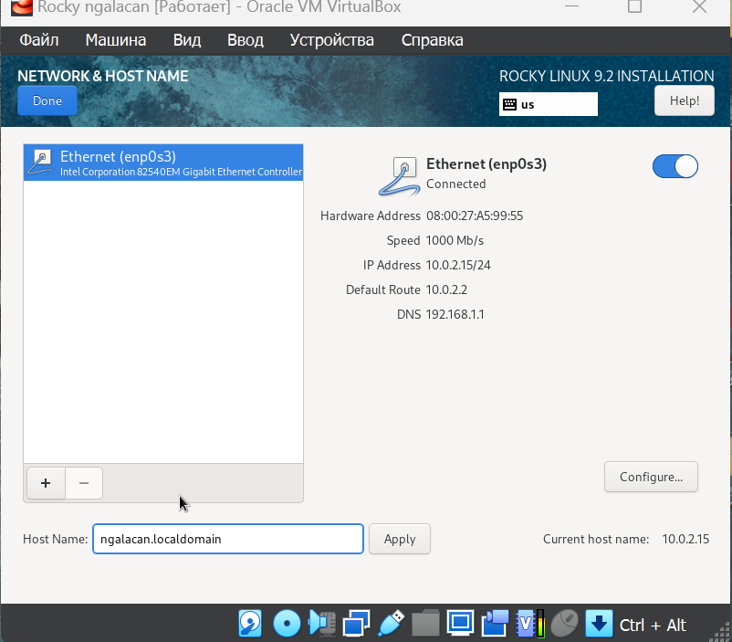{#fig:9 width=70%}

Устанавливаю root-пароль (рис. [-@fig:10]), после чего создаю пользователя с правами 
администратора и пароль для него (рис. [-@fig:11]).

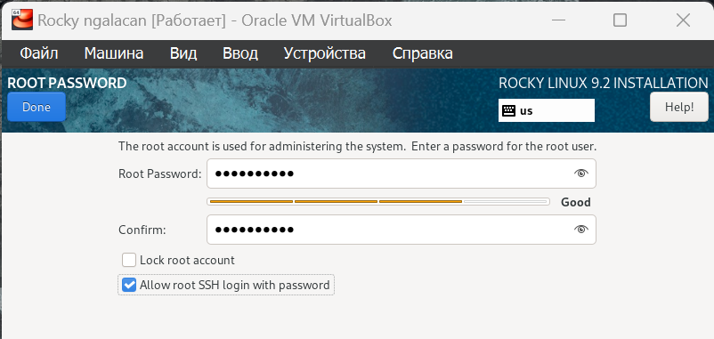{#fig:10 width=70%}

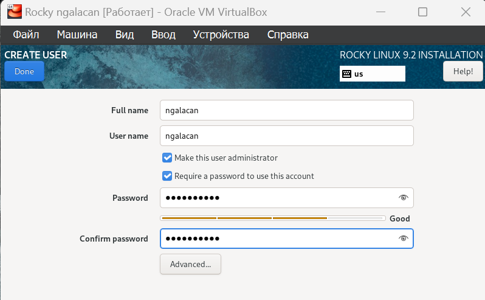{#fig:11 width=70%}

После настройки всех разделов запускаю установку (Begin Installation) и дожидаюсь ее окончания. Перезапускаю систему и вхожу под заданной при установке учетной  записью. В меню Устройства виртуальной машины подключаю образ диска дополнений гостевой ОС, запускаю (рис. [-@fig:12]). После установки перезагружаю систему.

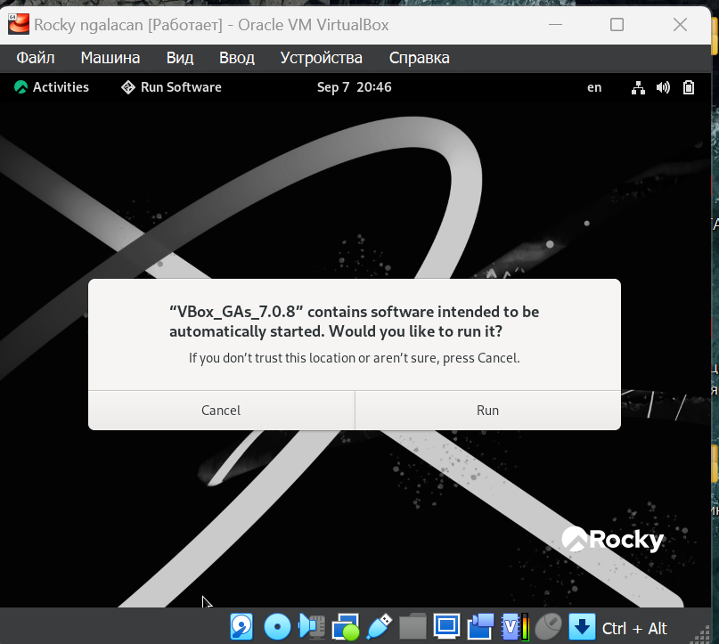{#fig:12 width=70%}

# Выполнение домашнего задания

Выполняю в терминале команду dmesg. Воспользовавшись поиском с помощью команды `dmesg | grep -i "то, что ищем"`, получаю следующую информацию: 

1. Версия ядра Linux (Linux version).
2. Частота процессора (Detected Mhz processor).
3. Модель процессора (CPU0).
4. Объем доступной оперативной памяти (Memory available).
5. Тип обнаруженного гипервизора (Hypervisor detected) (рис. [-@fig:13]).

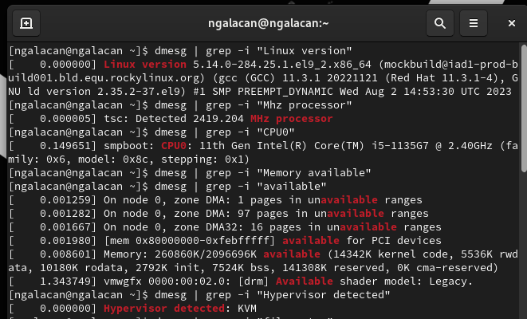{#fig:13 width=70%}

6. Тип файловой системы корневого раздела (введя `filesystem`).
7. Последовательность монтирования файловых систем (введя `mount`). (рис. [-@fig:14]).

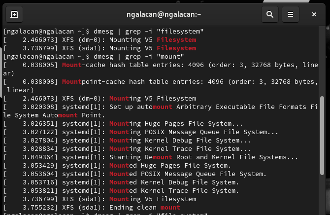{#fig:14 width=70%}

# Выводы

Я приобрел практические навыки установки операционной системы на виртуальную машину, ознакомился и научился использовать VirtualBox. В ходе работы были настроены минимально необходимые для дальнейшей работы сервисы, установлено необходимое ПО.

# Ответы на контрольные вопросы

1. Какую информацию содержит учётная запись пользователя?

Имя пользователя, пароль, домашний каталог, идентификационные номера пользователя и группы.

2. Укажите команды терминала и приведите примеры:

* для получения справки по команде - `man`, пример: `man man`;
* для перемещения по файловой системе - `cd`, пример: `cd ~`;
* для просмотра содержимого каталога - `ls`, пример: `ls lab01`;
* для определения объёма каталога - `du`, пример: `du report`;
* для создания / удаления каталогов / файлов - `mkdir`, пример: `mkdir newdir` (для создания каталогов); `touch`, пример: `touch 1.txt` (для создания файлов); `rm`, пример: `rm 1.txt` (для удаления);
* для задания определённых прав на файл / каталог - `chmod`, пример: `chmod 136 readme.txt`;
* для просмотра истории команд - `history`, пример: `history`;

3. Файловая система -  способ организации данных и информации в ОС, часть операционной системы для обеспечения удобного интерфейса для работы пользователя с данными, хранящимися на диске, а также для совместного использования файлов несколькими пользователями.
Примеры: 

Ext2, Ext3, Ext4 и др. - стандартные файловые системы Linux.

FAT12, FAT16, FAT32, NTFS - файловые системы Windows.

XFS - высокопроизводительная файловая система с высокой скоростью работы с большими данными.

4. Как посмотреть, какие файловые системы подмонтированы в ОС?

Просмотр подмонтированных файловых систем производится с помощью команды `mounted`.
5. Как удалить зависший процесс?

Удаление зависшего процесса производится с помощью команды `kill` (с указанием 
идентификатора процесса).
