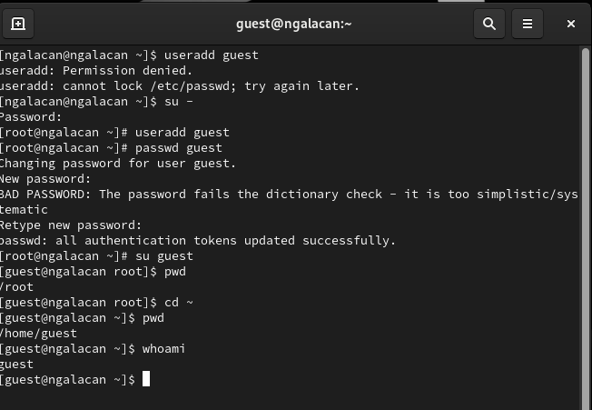
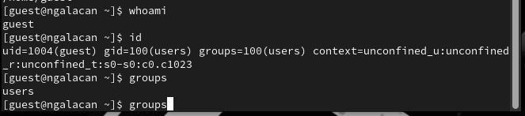
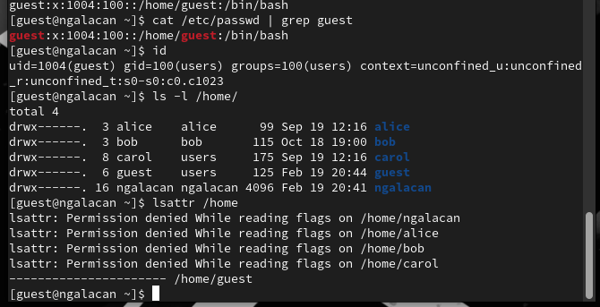
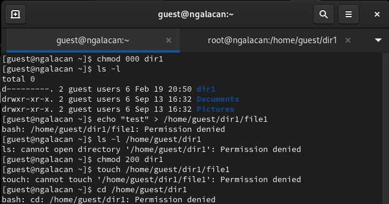
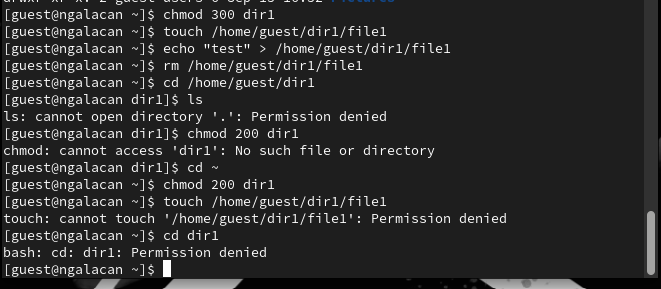

---
## Front matter
title: "Отчет по лабораторной работе №2"
subtitle: "Дискреционное разграничение прав в Linux. Основные атрибуты"
author: "Галацан Николай, НПИбд-01-22"

## Generic otions
lang: ru-RU
toc-title: "Содержание"

## Bibliography
bibliography: bib/cite.bib
csl: pandoc/csl/gost-r-7-0-5-2008-numeric.csl

## Pdf output format
toc: true # Table of contents
toc-depth: 2
lof: true # List of figures
lot: true # List of tables
fontsize: 12pt
linestretch: 1.5
papersize: a4
documentclass: scrreprt
## I18n polyglossia
polyglossia-lang:
  name: russian
  options:
	- spelling=modern
	- babelshorthands=true
polyglossia-otherlangs:
  name: english
## I18n babel
babel-lang: russian
babel-otherlangs: english
## Fonts
mainfont: PT Serif
romanfont: PT Serif
sansfont: PT Sans
monofont: PT Mono
mainfontoptions: Ligatures=TeX
romanfontoptions: Ligatures=TeX
sansfontoptions: Ligatures=TeX,Scale=MatchLowercase
monofontoptions: Scale=MatchLowercase,Scale=0.9
## Biblatex
biblatex: true
biblio-style: "gost-numeric"
biblatexoptions:
  - parentracker=true
  - backend=biber
  - hyperref=auto
  - language=auto
  - autolang=other*
  - citestyle=gost-numeric
## Pandoc-crossref LaTeX customization
figureTitle: "Рис."
tableTitle: "Таблица"
listingTitle: "Листинг"
lofTitle: "Список иллюстраций"
lotTitle: "Список таблиц"
lolTitle: "Листинги"
## Misc options
indent: true
header-includes:
  - \usepackage{indentfirst}
  - \usepackage{float} # keep figures where there are in the text
  - \floatplacement{figure}{H} # keep figures where there are in the text
---
# Цель работы

Получение практических навыков работы в консоли с атрибутами файлов, закрепление теоретических основ дискреционного разграничения доступа в современных системах с открытым кодом на базе ОС Linux [@infosec].

# Выполнение лабораторной работы

Создаю пользователя `guest`, задаю пароль и вхожу от его имени. Определяю директорию, в которой нахожусь: `root`. Перехожу в домашний каталог командой `cd ~` и проверяю (рис. [-@fig:1]).

{#fig:1 width=70%}

Уточняю имя пользователя, его группу, группы, куда входит пользователь: 
`guest, uid: 1004, gid: 100, group: users`. Команда `groups` показывает, к какой группе принадлежит пользователь, значение совпадает с выводом команды `id`. Данные из приглашения командной строки совпадают с данными из вывода команд (рис. [-@fig:2]).

{#fig:2 width=70%}

Просматриваю файл `/etc/passwd` и данные о пользователе. Данные аналогичны тем, что были получены при помощи команды `id`. Определяю существующие в системе директории. На директориях установлены права на чтение, запись и выполнение для владельца. Проверяю расширенные атрибуты для директорий, но вижу только для своей. Так как я не являюсь владельцем остальных, их разрешения мне недоступны (рис. [-@fig:3]).

{#fig:3 width=70%}

Создаю директорию dir1 и определяю права доступа: для владельца доступны все права, для остальных - чтение и выполнение. Меняю права на 000, тем самым отозвав все разрешения. Пытаюсь создать файл и запись в нем, но получаю отказ, так как права были отозваны. Файл не был создан (рис. [-@fig:4]).

{#fig:4 width=70%}

Для заполнения таблиц 1 и 2 меняю права на директорию и пытаюсь производить операции (рис. [-@fig:5]). Если операция разрешена, заношу"+", если нет, заношу "-".

{#fig:5 width=70%}

Таблица 2.1.

{ width=100%}

Таблица 2.2.

{ width=80%}

# Выводы

Были получены практические навыки работы в консоли с атрибутами файлов, закрепление теоретических основ дискреционного разграничения доступа в современных системах с открытым кодом на базе ОС Linux.

# Список литературы{.unnumbered}

::: {#refs}
:::

