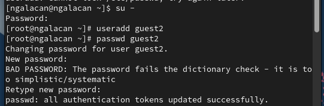
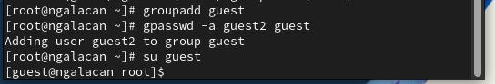
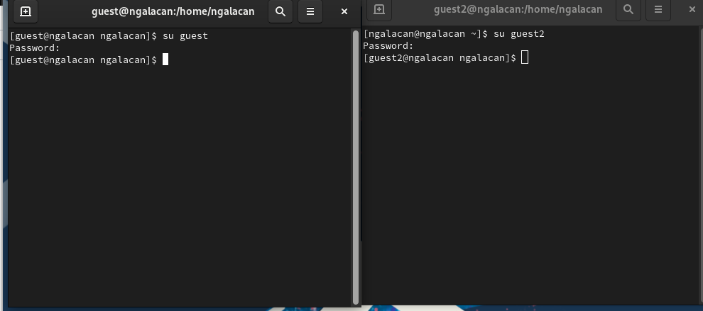
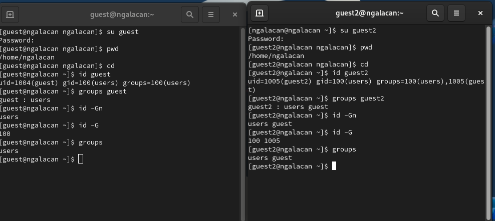
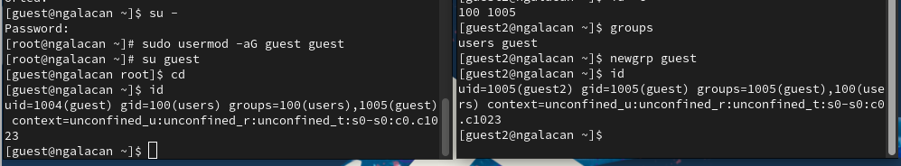
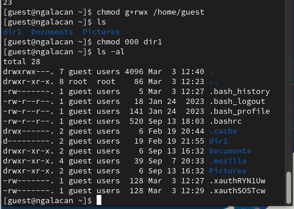
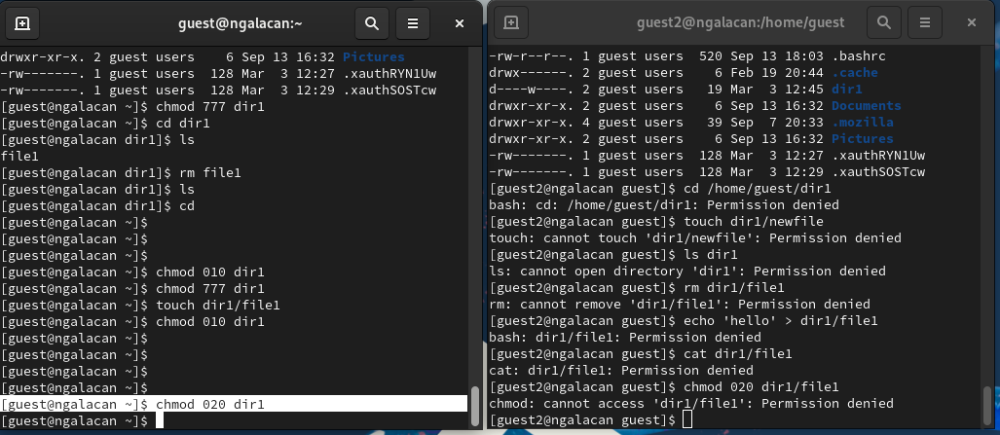

---
## Front matter
lang: ru-RU
title: Презентация по лабораторной работе №3
subtitle: "Дискреционное разграничение прав в Linux. Два пользователя"
author:
  - Галацан Николай
institute:
  - Российский университет дружбы народов, Москва, Россия

## i18n babel
babel-lang: russian
babel-otherlangs: english

## Formatting pdf
toc: false
toc-title: Содержание
slide_level: 2
aspectratio: 169
section-titles: true
theme: metropolis
header-includes:
 - \metroset{progressbar=frametitle,sectionpage=progressbar,numbering=fraction}
 - '\makeatletter'
 - '\beamer@ignorenonframefalse'
 - '\makeatother'
---

## Докладчик

  * Галацан Николай
  * 1032225763
  * уч. группа: НПИбд-01-22
  * Факультет физико-математических и естественных наук
  * Российский университет дружбы народов

## Цели и задачи

Получение практических навыков работы в консоли с атрибутами файлов для групп пользователей.

## Выполнение лабораторной работы

{#fig:1 width=70%}

## Выполнение лабораторной работы

{#fig:2 width=70%}

## Выполнение лабораторной работы

{#fig:3 width=70%}

## Выполнение лабораторной работы

{#fig:4 width=70%}

## Выполнение лабораторной работы

{#fig:5 width=70%}

## Выполнение лабораторной работы

{#fig:6 width=70%}

## Выполнение лабораторной работы

{#fig:7 width=70%}

## Выполнение лабораторной работы

: Установленные права и разрешённые действия для групп {#tbl:1}

| Права  директории 	| Права файла 	| Создание файла 	| Удаление файла 	| Запись в файл 	| Чтение файла 	| Смена директории 	| Просмотр файлов | Переименование файла 	| Смена атрибутов файла 	|
|---	|---	|---	|---	|---	|---	|---	|---	|---	|---	|
| 000 	| 000 	| - 	| - 	| - 	| - 	| - 	| - 	| - 	| - 	|
| 010 	| 010 	| - 	| - 	| - 	| - 	| + 	| + 	| - 	| - 	|
| 020 	| 020 	| - 	| - 	| - 	| - 	| - 	| - 	| - 	| - 	|
| 030 	| 030 	| + 	| + 	| - 	| + 	| + 	| - 	| + 	| - 	|
| 040 	| 040 	| - 	| - 	| - 	| + 	| - 	| - 	| - 	| - 	|
| 050 	| 050 	| - 	| - 	| - 	| + 	| + 	| + 	| - 	| - 	|
| 060 	| 060 	| - 	| - 	| + 	| + 	| - 	| -	| - 	| - 	|
| 070 	| 070 	| + 	| + 	| + 	| + 	| + 	| + 	| + 	| + 	|

## Выполнение лабораторной работы

: Минимальные права для совершения операций от имени пользователей входящих в группу {#tbl:2}

| Операция                   | Минимальные права на директорию | Минимальные права на файл |
|----------------------------|-------------------------------------|-------------------------------|
| Создание файла             | 030                                 | 020                           |
| Удаление файла             | 030                                 | 020                           |
| Чтение файла               | 050                                 | 040                           |
| Запись в файл              | 030                                 | 020                           |
| Переименование файла       | 030                                 | 020                           |
| Создание поддиректории     | 030                                 | 030                           |
| Удаление поддиректории     | 030                                 | 030                           |

## Выводы

Получены практические навыки работы в консоли с атрибутами файлов для групп пользователей.

