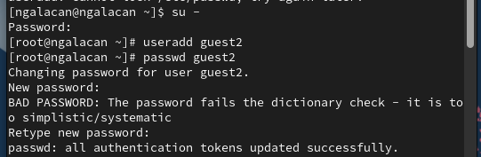
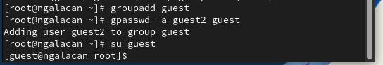
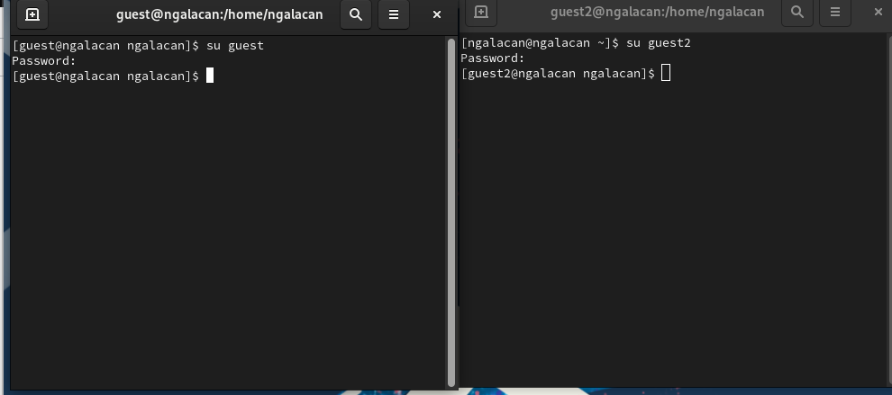
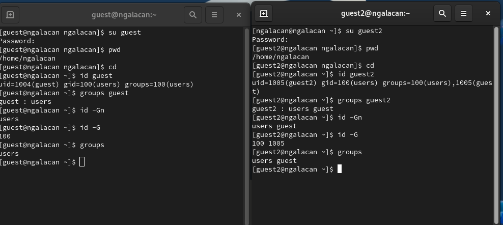
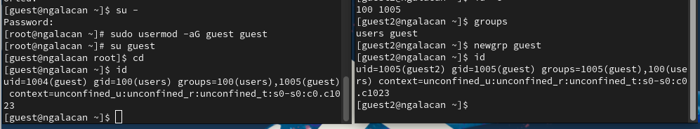
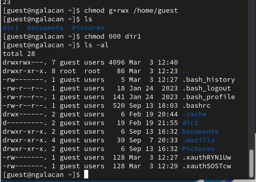
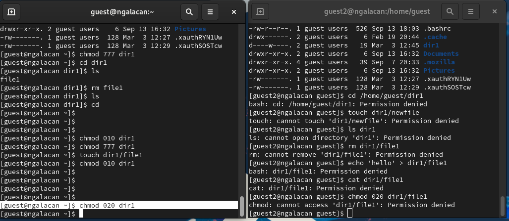

---
## Front matter
title: "Отчет по лабораторной работе №3"
subtitle: "Дискреционное разграничение прав в Linux. Два пользователя"
author: "Галацан Николай, НПИбд-01-22"

## Generic otions
lang: ru-RU
toc-title: "Содержание"

## Bibliography
bibliography: bib/cite.bib
csl: pandoc/csl/gost-r-7-0-5-2008-numeric.csl

## Pdf output format
toc: true # Table of contents
toc-depth: 2
lof: true # List of figures
lot: true # List of tables
fontsize: 12pt
linestretch: 1.5
papersize: a4
documentclass: scrreprt
## I18n polyglossia
polyglossia-lang:
  name: russian
  options:
	- spelling=modern
	- babelshorthands=true
polyglossia-otherlangs:
  name: english
## I18n babel
babel-lang: russian
babel-otherlangs: english
## Fonts
mainfont: PT Serif
romanfont: PT Serif
sansfont: PT Sans
monofont: PT Mono
mainfontoptions: Ligatures=TeX
romanfontoptions: Ligatures=TeX
sansfontoptions: Ligatures=TeX,Scale=MatchLowercase
monofontoptions: Scale=MatchLowercase,Scale=0.9
## Biblatex
biblatex: true
biblio-style: "gost-numeric"
biblatexoptions:
  - parentracker=true
  - backend=biber
  - hyperref=auto
  - language=auto
  - autolang=other*
  - citestyle=gost-numeric
## Pandoc-crossref LaTeX customization
figureTitle: "Рис."
tableTitle: "Таблица"
listingTitle: "Листинг"
lofTitle: "Список иллюстраций"
lotTitle: "Список таблиц"
lolTitle: "Листинги"
## Misc options
indent: true
header-includes:
  - \usepackage{indentfirst}
  - \usepackage{float} # keep figures where there are in the text
  - \floatplacement{figure}{H} # keep figures where there are in the text
---
# Цель работы

Получение практических навыков работы в консоли с атрибутами файлов для групп пользователей.

# Выполнение лабораторной работы [@infosec]

Создаю пользователей `guest` `guest2`, задаю пароль(рис. [-@fig:1]).

{#fig:1 width=70%}

Добавляю пользователя `guest2` в группу `guest` (рис. [-@fig:2]).

{#fig:2 width=70%}

Осуществляю вход в систему от двух пользователей на двух разных консолях: `guest` на первой консоли и `guest2` на второй консоли (рис. [-@fig:3]).

{#fig:3 width=70%}

Определяю директорию, в которой нахожусь. Она совпадает с приглашением командной строки.
Уточняю имя пользователя, его группу, группы, куда входит пользователь: 
```
guest, uid: 1004, gid: 100, groups: users
guest2, uid: 1005, gid: 100, groups: users, guest
```
 Команда `groups` показывает, к какой группе принадлежит пользователь, значение совпадает с выводом команды `id -Gn`. Файл `/etc/groups` содержит информацию о группах и состоящих в них пользователях (рис. [-@fig:4]).

{#fig:4 width=70%}

От имени пользователя `guest2` выполняю регистрацию пользователя `guest2` в группе `guest`. Добавляю пользователя `guest` в эту же группу, так как изначально он в ней не состоял из-за измененного в первом семестре файла конфигурации (рис. [-@fig:5]).

{#fig:5 width=70%}

От имени пользователя `guest` меняю права директории `/home/guest`, разрешив все действия для пользователей группы.
Снимаю с директории `/home/guest/dir1` все атрибуты и проверяю (рис. [-@fig:6]).

{#fig:6 width=70%}


Для заполнения таблиц 1 и 2 меняю права на директорию от имени пользователя `guest` и пытаюсь производить операции от имени пользователя `guest2` (рис. [-@fig:7]). Если операция разрешена, заношу "+", если нет, заношу "-". (табл. [-@tbl:1]). Определяю минимально необходимые права для выполнения операций (табл. [-@tbl:2]).

{#fig:7 width=70%}

: Установленные права и разрешённые действия для групп {#tbl:1}

| Права  директории 	| Права файла 	| Создание файла 	| Удаление файла 	| Запись в файл 	| Чтение файла 	| Смена директории 	| Просмотр файлов в директории 	| Переименование файла 	| Смена атрибутов файла 	|
|---	|---	|---	|---	|---	|---	|---	|---	|---	|---	|
| 000 	| 000 	| - 	| - 	| - 	| - 	| - 	| - 	| - 	| - 	|
| 010 	| 010 	| - 	| - 	| - 	| - 	| + 	| + 	| - 	| - 	|
| 020 	| 020 	| - 	| - 	| - 	| - 	| - 	| - 	| - 	| - 	|
| 030 	| 030 	| + 	| + 	| - 	| + 	| + 	| - 	| + 	| - 	|
| 040 	| 040 	| - 	| - 	| - 	| + 	| - 	| - 	| - 	| - 	|
| 050 	| 050 	| - 	| - 	| - 	| + 	| + 	| + 	| - 	| - 	|
| 060 	| 060 	| - 	| - 	| + 	| + 	| - 	| -	| - 	| - 	|
| 070 	| 070 	| + 	| + 	| + 	| + 	| + 	| + 	| + 	| + 	|


: Минимальные права для совершения операций от имени пользователей входящих в группу {#tbl:2}

| Операция                   | Минимальные права на директорию | Минимальные права на файл |
|----------------------------|-------------------------------------|-------------------------------|
| Создание файла             | 030                                 | 020                           |
| Удаление файла             | 030                                 | 020                           |
| Чтение файла               | 050                                 | 040                           |
| Запись в файл              | 030                                 | 020                           |
| Переименование файла       | 030                                 | 020                           |
| Создание поддиректории     | 030                                 | 030                           |
| Удаление поддиректории     | 030                                 | 030                           |

# Выводы

Получены практические навыки работы в консоли с атрибутами файлов для групп пользователей.

# Список литературы{.unnumbered}

::: {#refs}
:::

