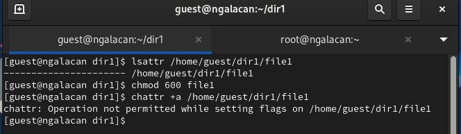
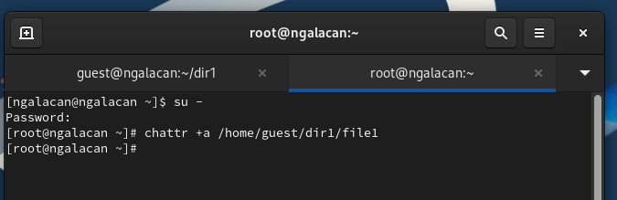
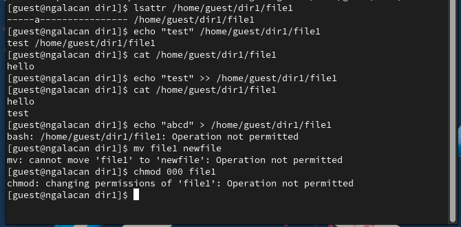
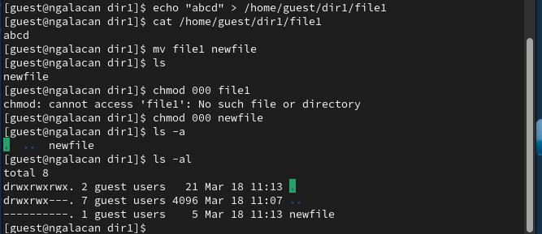
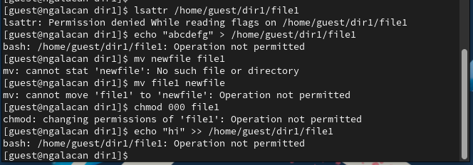

---
## Front matter
title: "Отчет по лабораторной работе №4"
subtitle: "Дискреционное разграничение прав в Linux. Расширенные атрибуты"
author: "Галацан Николай, НПИбд-01-22"

## Generic otions
lang: ru-RU
toc-title: "Содержание"

## Bibliography
bibliography: bib/cite.bib
csl: pandoc/csl/gost-r-7-0-5-2008-numeric.csl

## Pdf output format
toc: true # Table of contents
toc-depth: 2
lof: true # List of figures
lot: false # List of tables
fontsize: 12pt
linestretch: 1.5
papersize: a4
documentclass: scrreprt
## I18n polyglossia
polyglossia-lang:
  name: russian
  options:
	- spelling=modern
	- babelshorthands=true
polyglossia-otherlangs:
  name: english
## I18n babel
babel-lang: russian
babel-otherlangs: english
## Fonts
mainfont: PT Serif
romanfont: PT Serif
sansfont: PT Sans
monofont: PT Mono
mainfontoptions: Ligatures=TeX
romanfontoptions: Ligatures=TeX
sansfontoptions: Ligatures=TeX,Scale=MatchLowercase
monofontoptions: Scale=MatchLowercase,Scale=0.9
## Biblatex
biblatex: true
biblio-style: "gost-numeric"
biblatexoptions:
  - parentracker=true
  - backend=biber
  - hyperref=auto
  - language=auto
  - autolang=other*
  - citestyle=gost-numeric
## Pandoc-crossref LaTeX customization
figureTitle: "Рис."
tableTitle: "Таблица"
listingTitle: "Листинг"
lofTitle: "Список иллюстраций"
lotTitle: "Список таблиц"
lolTitle: "Листинги"
## Misc options
indent: true
header-includes:
  - \usepackage{indentfirst}
  - \usepackage{float} # keep figures where there are in the text
  - \floatplacement{figure}{H} # keep figures where there are in the text
---
# Цель работы

Получение практических навыков работы в консоли с расширенными атрибутами файлов.

# Выполнение лабораторной работы [@infosec]

От имени пользователя `guest` определяю расширенные атрибуты файла `/home/guest/dir1/file1`. Устанавливаю на файл права, разрешающие чтение и запись для владельца файла. Пробую установить расширенный атрибут `a`, но получаю отказ в доступе (рис. [-@fig:1]).

{#fig:1 width=70%}

В консоли с правами суперпользователя устанавливаю атрибут `a` на файл (рис. [-@fig:2]).

{#fig:2 width=70%}

От имени пользователя `guest` убеждаюсь, что атрибут установлен. Произвожу дозапись в файл командой `echo "test" >> /home/guest/dir1/file1`. Пытаюсь полностью перезаписать файл, переименовать его, отозвать все права на файл, однако получаю отказ в доступе (рис. [-@fig:3]).

{#fig:3 width=70%}

От имени суперпользователя снимаю атрибут `a` и повторяю все вышеуказанные операции. Дозапись, перезапись, переименование, изменение прав выполняются успешно (рис. [-@fig:4]).

{#fig:4 width=70%}

От имени суперпользователя устанавливаю атрибут `i`, убеждаюсь в этом, и снова пытаюсь произвести вышеуказанные операции. Все попытки оканчиваются отказом в доступе (рис. [-@fig:5]).

{#fig:5 width=70%}

Атрибут `a` позволяет добавлять изменения в файл, но не удалять его, поэтому при данном атрибуте можно было дозаписать в файл. Атрибут `i` запрещает вносить любые изменения в файл, поэтому ни одна операция не окончилась успехом, в том числе и дозапись.

# Выводы

Получены практические навыки работы в консоли с расширенными атрибутами файлов.

# Список литературы{.unnumbered}

::: {#refs}
:::

