---
## Front matter
title: "Отчет по лабораторной работе №5"
subtitle: "Дискреционное разграничение прав в Linux. Исследование влияния дополнительных атрибутов"
author: "Галацан Николай, НПИбд-01-22"

## Generic otions
lang: ru-RU
toc-title: "Содержание"

## Bibliography
bibliography: bib/cite.bib
csl: pandoc/csl/gost-r-7-0-5-2008-numeric.csl

## Pdf output format
toc: true # Table of contents
toc-depth: 2
lof: true # List of figures
lot: false # List of tables
fontsize: 12pt
linestretch: 1.5
papersize: a4
documentclass: scrreprt
## I18n polyglossia
polyglossia-lang:
  name: russian
  options:
	- spelling=modern
	- babelshorthands=true
polyglossia-otherlangs:
  name: english
## I18n babel
babel-lang: russian
babel-otherlangs: english
## Fonts
mainfont: PT Serif
romanfont: PT Serif
sansfont: PT Sans
monofont: PT Mono
mainfontoptions: Ligatures=TeX
romanfontoptions: Ligatures=TeX
sansfontoptions: Ligatures=TeX,Scale=MatchLowercase
monofontoptions: Scale=MatchLowercase,Scale=0.9
## Biblatex
biblatex: true
biblio-style: "gost-numeric"
biblatexoptions:
  - parentracker=true
  - backend=biber
  - hyperref=auto
  - language=auto
  - autolang=other*
  - citestyle=gost-numeric
## Pandoc-crossref LaTeX customization
figureTitle: "Рис."
tableTitle: "Таблица"
listingTitle: "Листинг"
lofTitle: "Список иллюстраций"
lotTitle: "Список таблиц"
lolTitle: "Листинги"
## Misc options
indent: true
header-includes:
  - \usepackage{indentfirst}
  - \usepackage{float} # keep figures where there are in the text
  - \floatplacement{figure}{H} # keep figures where there are in the text
---
# Цель работы

Изучение механизмов изменения идентификаторов, применения
SetUID- и Sticky-битов. Получение практических навыков работы в консоли с дополнительными атрибутами. Рассмотрение работы механизма
смены идентификатора процессов пользователей, а также влияние бита
Sticky на запись и удаление файлов. [@infosec]

# Выполнение лабораторной работы [@infosec]

## Создание программы

От имени пользователя `guest` создаю программу `simpleid.c` (рис. [-@fig:1]).

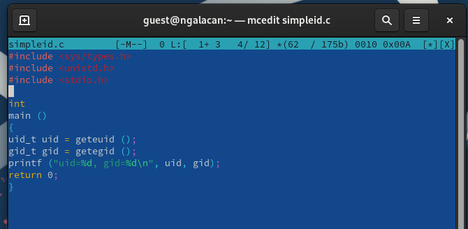{#fig:1 width=70%}

Компилирую программу командой `gcc simpleid.c -o simpleid` и выполняю. Выполняю системную программу `id` и убеждаюсь, что обе программы выводят одинаковые данные (рис. [-@fig:2]).

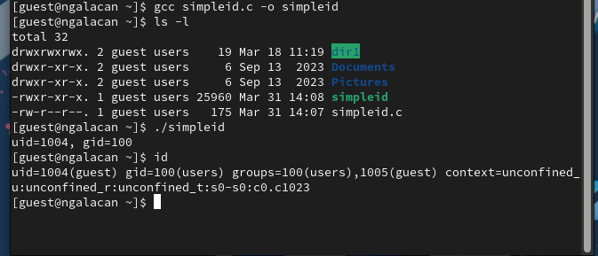{#fig:2 width=70%}

Cоздаю усложненную программу `simpleid2.c`  (рис. [-@fig:3]).

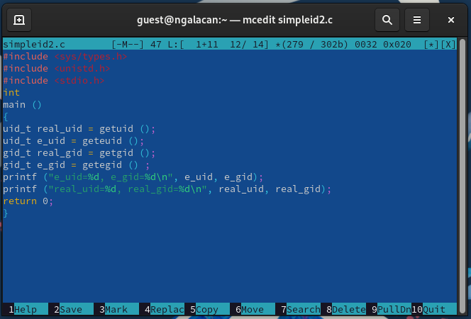{#fig:3 width=70%}

Компилирую и запускаю (рис. [-@fig:4]).

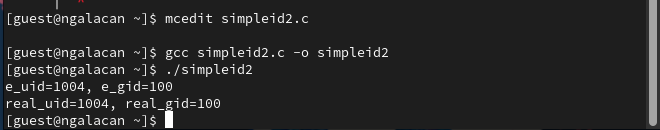{#fig:4 width=70%}

От имени суперпользователя изменяю владельца файла и добавляю атрибут `s`. Это означает, что пользователь будет выполнять файл с разрешениями владельца файла. Проверяю правильность и запускаю программу, вновь сравниваю с id. Исходя из этого, можно сказать, что теперь владельцем файла является пользователь с id 0 (`root`), а изначально владельцем файла был пользователь с id 1004 (`guest`) (рис. [-@fig:5]).

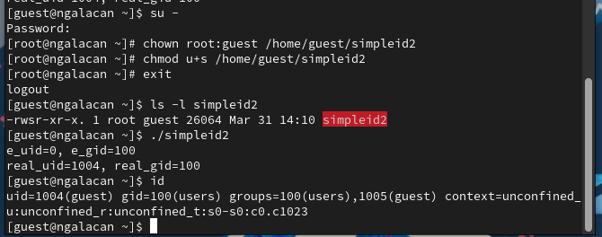{#fig:5 width=70%}

То же самое проделываю для SetGID бита (рис. [-@fig:6]).

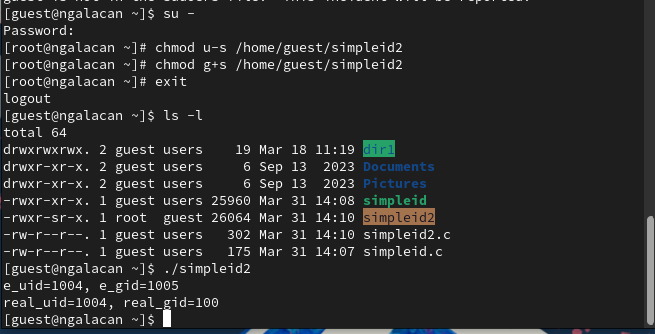{#fig:6 width=70%}

Создаю программу `readfile.c` (рис. [-@fig:7]).

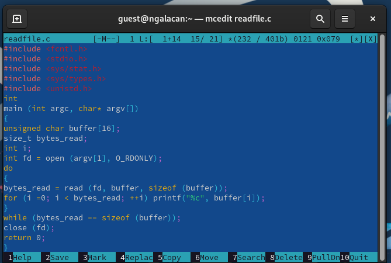{#fig:7 width=70%}

Компилирую ее, изменяю у файла `readfile.c` владельца, изменяю права доступа так, чтобы только суперпользователь мог прочитать его, a guest не мог. После проверяю, что пользователь guest не может прочитать файл (рис. [-@fig:8]).

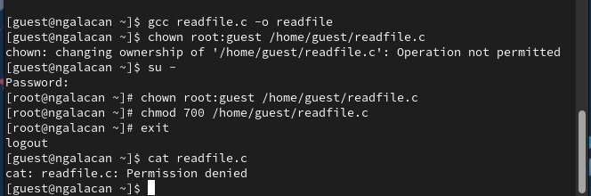{#fig:8 width=70%}

Изменяю у программы `readfile` владельца, устанавливаю SetUID-бит. Проверяю, что программа может прочитать файлы `readfile.c` и `/etc/shadow` (рис. [-@fig:9]).

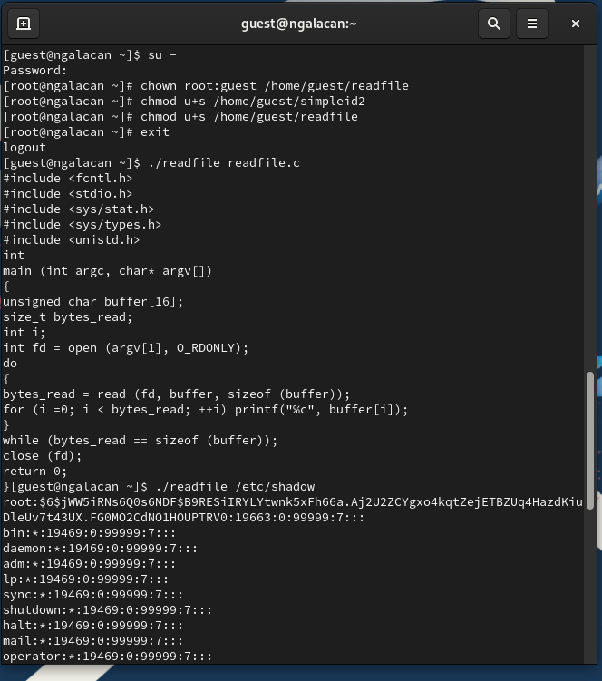{#fig:9 width=70%}

## Исследование Sticky-бита

Проверяю, установлен ли атрибут Sticky на директории `/tmp`. От пользователя guest создаю файл со словом test командой `echo “test” > /tmp/file01.txt`. Просматриваю атрибуты у только что созданного файла и разрешаю чтение и запись для остальных пользователей. От пользователя guest2 пробую прочитать файл (успешно) и внести изменения в файл (отказ в доступе) (рис. [-@fig:10]).

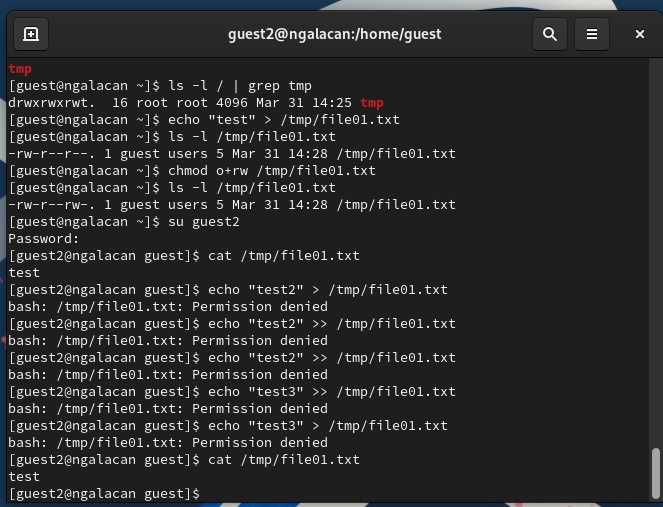{#fig:10 width=70%}

Пытаюсь удалить файл (отказ в доступе) (рис. [-@fig:11]).

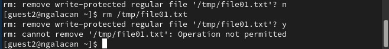{#fig:11 width=70%}

От имени суперпользователя снимаю атрибут `t` с директории `/tmp` и от имени guest2 проверяю. Повторяю предыдущие шаги: просмотр файла разрешен, запись в файл не разрешена, удаление файла разрешено. В конце возвращаю атрибут `t` на директорию `/tmp` от имени суперпользователя (рис. [-@fig:12]).

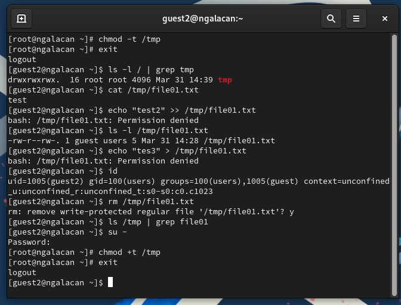{#fig:12 width=70%}

# Выводы

Были изучены механизмы изменения идентификаторов, применения
SetUID- и Sticky-битов. Получены практические навыки работы в консоли с дополнительными атрибутами. Рассмотрены работы механизма
смены идентификатора процессов пользователей, а также влияние бита Sticky на запись и удаление файлов.

# Список литературы{.unnumbered}

::: {#refs}
:::

