---
## Front matter
title: "Отчет по лабораторной работе №6"
subtitle: "Мандатное разграничение прав в Linux"
author: "Галацан Николай, НПИбд-01-22"

## Generic otions
lang: ru-RU
toc-title: "Содержание"

## Bibliography
bibliography: bib/cite.bib
csl: pandoc/csl/gost-r-7-0-5-2008-numeric.csl

## Pdf output format
toc: true # Table of contents
toc-depth: 2
lof: true # List of figures
lot: false # List of tables
fontsize: 12pt
linestretch: 1.5
papersize: a4
documentclass: scrreprt
## I18n polyglossia
polyglossia-lang:
  name: russian
  options:
	- spelling=modern
	- babelshorthands=true
polyglossia-otherlangs:
  name: english
## I18n babel
babel-lang: russian
babel-otherlangs: english
## Fonts
mainfont: PT Serif
romanfont: PT Serif
sansfont: PT Sans
monofont: PT Mono
mainfontoptions: Ligatures=TeX
romanfontoptions: Ligatures=TeX
sansfontoptions: Ligatures=TeX,Scale=MatchLowercase
monofontoptions: Scale=MatchLowercase,Scale=0.9
## Biblatex
biblatex: true
biblio-style: "gost-numeric"
biblatexoptions:
  - parentracker=true
  - backend=biber
  - hyperref=auto
  - language=auto
  - autolang=other*
  - citestyle=gost-numeric
## Pandoc-crossref LaTeX customization
figureTitle: "Рис."
tableTitle: "Таблица"
listingTitle: "Листинг"
lofTitle: "Список иллюстраций"
lotTitle: "Список таблиц"
lolTitle: "Листинги"
## Misc options
indent: true
header-includes:
  - \usepackage{indentfirst}
  - \usepackage{float} # keep figures where there are in the text
  - \floatplacement{figure}{H} # keep figures where there are in the text
---
# Цель работы

Развить навыки администрирования ОС Linux. Получить первое практическое знакомство с технологией SELinux.
Проверить работу SELinx на практике совместно с веб-сервером Apache. [@infosec]

# Выполнение лабораторной работы [@infosec]

Убеждаюсь, что SELinux работает в режиме enforcing политики targeted. Также убеждаюсь, что веб-сервер запущен и работает (рис. [-@fig:1]).

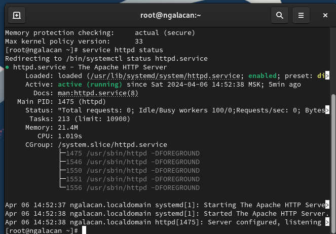{#fig:1 width=70%}

Определяю контекст безопасности веб-сервера Apache. Просматриваю текущее состояние переключателей SELinux (рис. [-@fig:2]).

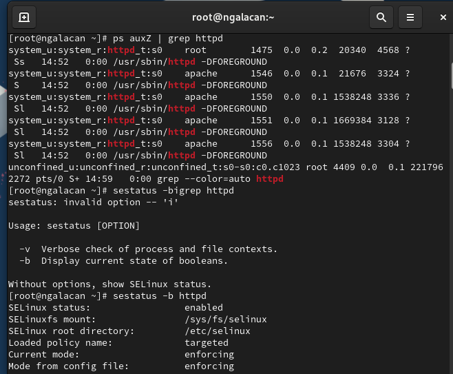{#fig:2 width=70%}

Просматриваю статистику по политике с помощью команды `seinfo` (рис. [-@fig:3]).

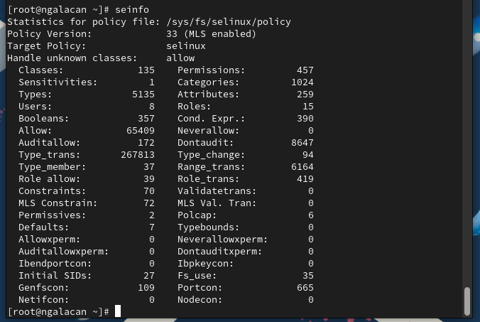{#fig:3 width=70%}

Определяю тип файлов и поддиректорий, находящихся в директории `/var/www`, `/var/www/html`, создаю файл `test.html` следующего содержания:

```
<html>
<body>test</body>
</html>

```
и проверяю контекст созданного файла (рис. [-@fig:4]).

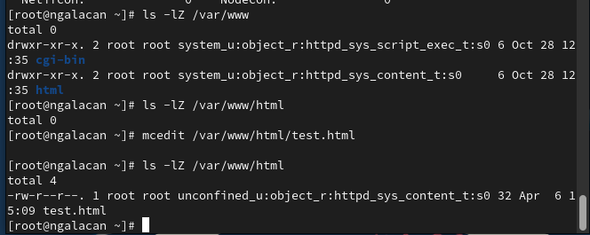{#fig:4 width=70%}

Обращаюсь к файлу через веб-сервер и вижу простую веб-страницу (рис. [-@fig:5]).

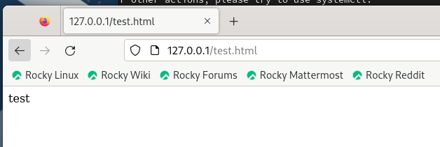{#fig:5 width=70%}

Просматриваю справку по `httpd` и `selinux`. Проверяю контекст файла. Тип `httpd_sys_content_t` позволяет процессу `httpd` получить доступ к файлу. Благодаря наличию последнего типа мы получили доступ к файлу при обращении к нему через браузер. Меняю контекст файла и проверяю. Пробую еще раз открыть файл в браузере, но файл не отображается по той причине, что `httpd` не имеет доступа к измененному контексту файла (рис. [-@fig:6]).

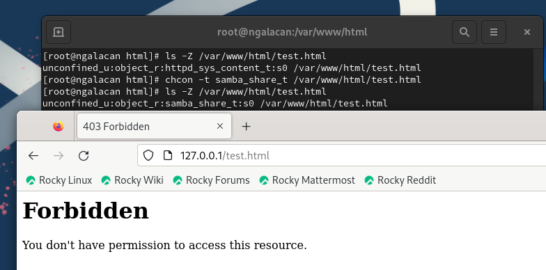{#fig:6 width=70%}

Просматриваю лог-файлы (рис. [-@fig:7]).

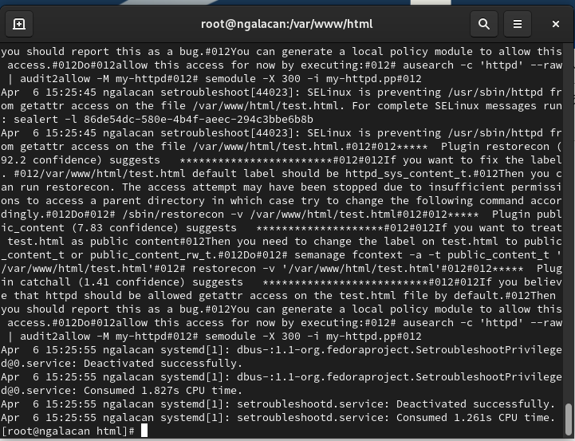{#fig:7 width=70%}

В файле `/etc/httpd/conf/httpd.conf` меняю порт на 81 (рис. [-@fig:8]).

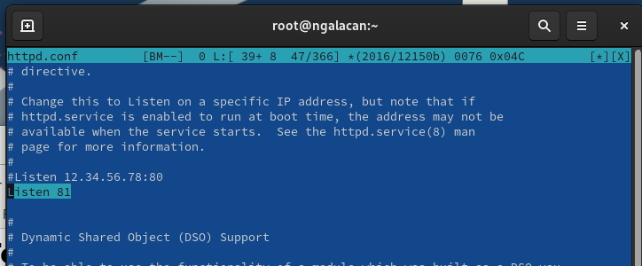{#fig:8 width=70%}

Перезагружаю веб-сервер и наблюдаю сбой (рис. [-@fig:9]).

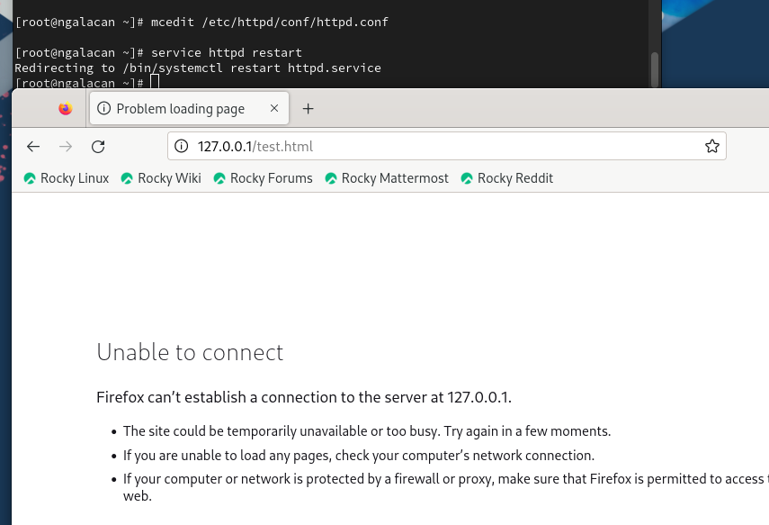{#fig:9 width=70%}

Анализирую лог-файлы (рис. [-@fig:10]).

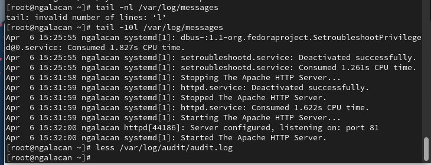{#fig:10 width=70%}

Выполняю команду `semanage port -a -t http_port_t -р tcp 81` и проверяю список портов командой `semanage port -l | grep http_port_t` и вижу, что порт 81 появился в списке. Перезагружаю веб-сервер. Возвращаю контекст для `test.html`, к которому `httpd` имеет доступ (рис. [-@fig:11]).

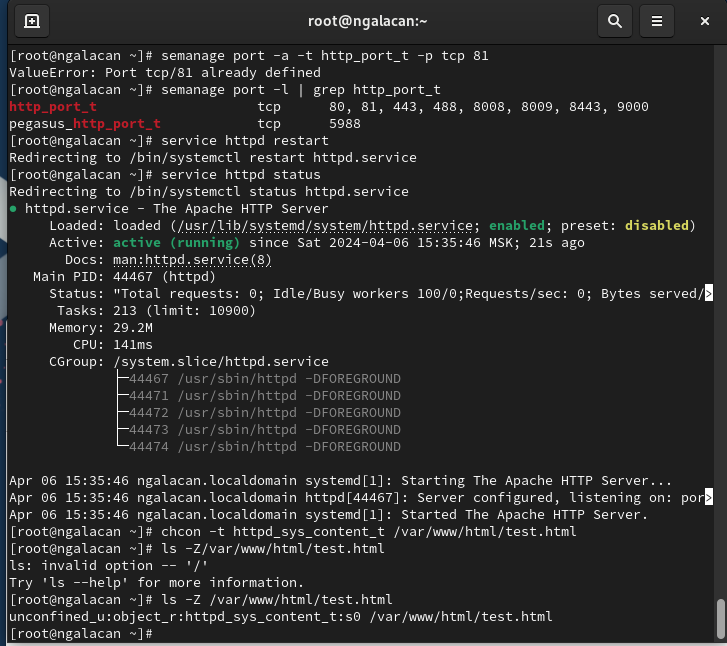{#fig:11 width=70%}

После этого тестовая страница вновь открывается в браузере.

Исправляю конфигурационный файл обратно, изменив порт на 80. Удаляю привязку `http_port_t` к 81 порту. Удаляю файл `/var/www/html/test.html` (рис. [-@fig:12]).

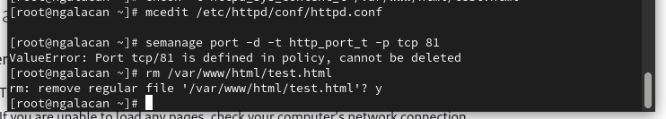{#fig:12 width=70%}

# Выводы

Я развил навыки администрирования ОС Linux, познакомился с технологией SELinux. Проверена работа SELinux на практике совместно с веб-сервером Apache.

# Список литературы{.unnumbered}

::: {#refs}
:::

