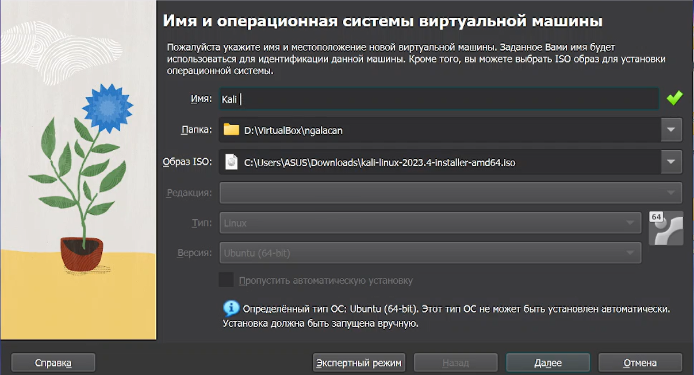
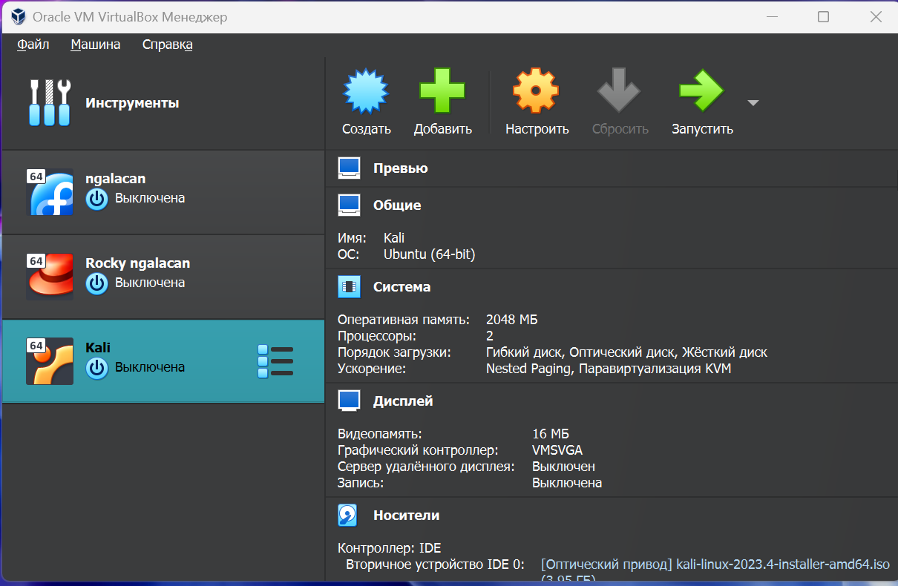
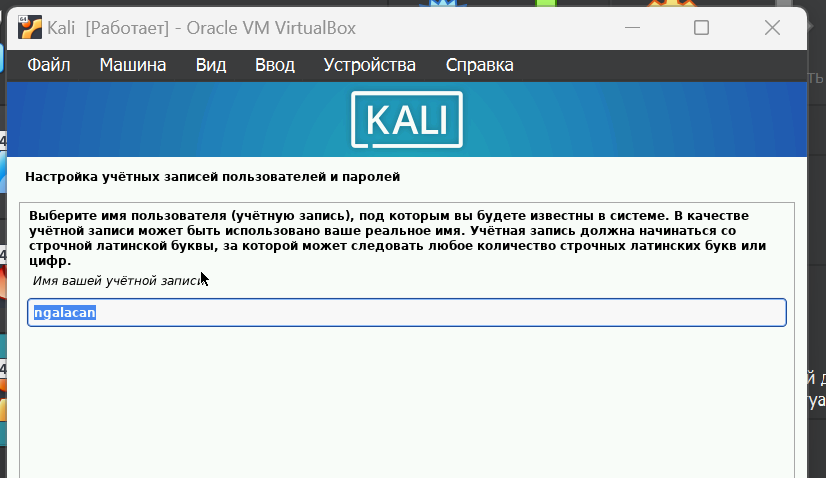
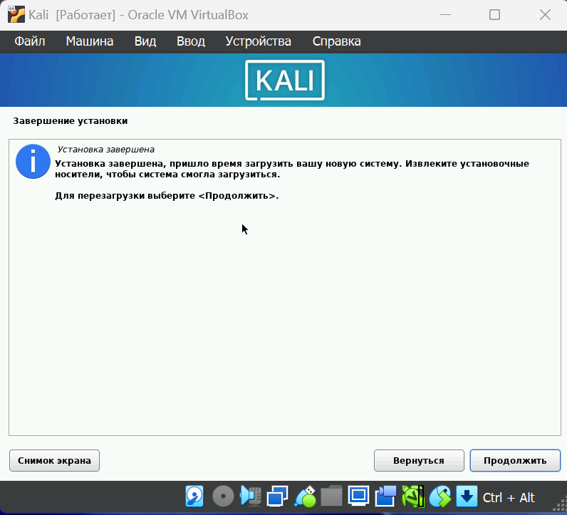
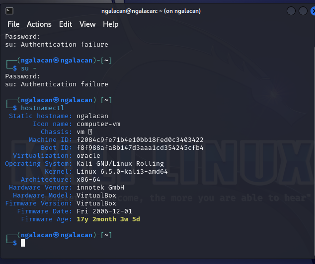

---
## Front matter
lang: ru-RU
title: Презентация по этапу №1
subtitle: Установка Kali Linux
author:
  - Галацан Николай
institute:
  - Российский университет дружбы народов, Москва, Россия

## i18n babel
babel-lang: russian
babel-otherlangs: english

## Formatting pdf
toc: false
toc-title: Содержание
slide_level: 2
aspectratio: 169
section-titles: true
theme: metropolis
header-includes:
 - \metroset{progressbar=frametitle,sectionpage=progressbar,numbering=fraction}
 - '\makeatletter'
 - '\beamer@ignorenonframefalse'
 - '\makeatother'
---

## Докладчик

  * Галацан Николай
  * 1032225763
  * уч. группа: НПИбд-01-22
  * Факультет физико-математических и естественных наук
  * Российский университет дружбы народов

## Цели и задачи

Приобретение практических навыков установки ОС на виртуальную машину.

## Выполнение лабораторной работы

{#fig:1 width=70%}

## Выполнение лабораторной работы

{#fig:2 width=70%}

## Выполнение лабораторной работы

{#fig:3 width=60%}

## Выполнение лабораторной работы

{#fig:4 width=40%}

## Выполнение лабораторной работы

{#fig:5 width=40%}

## Выводы

Я приобрел практические навыки установки операционной системы на виртуальную машину. В ходе работы были настроены минимально необходимые для дальнейшей работы сервисы, установлено необходимое ПО.

