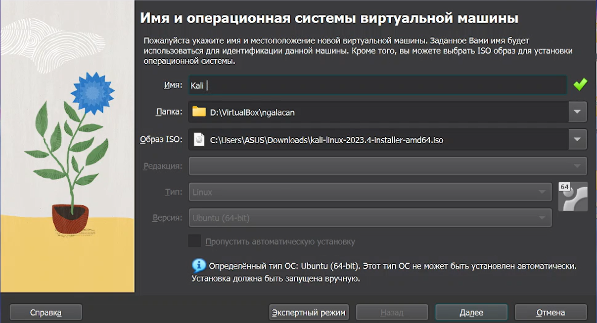
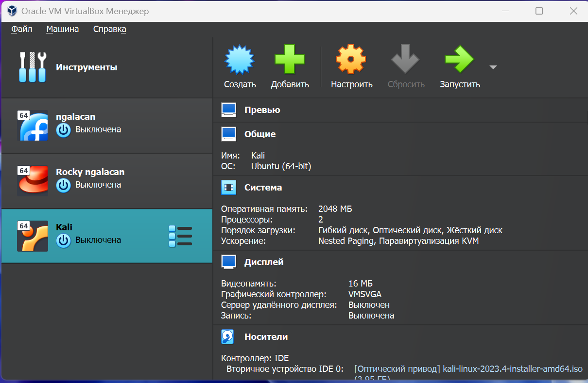
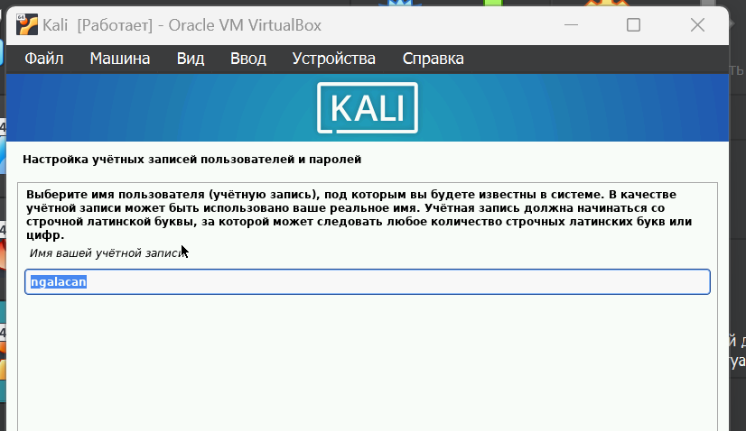
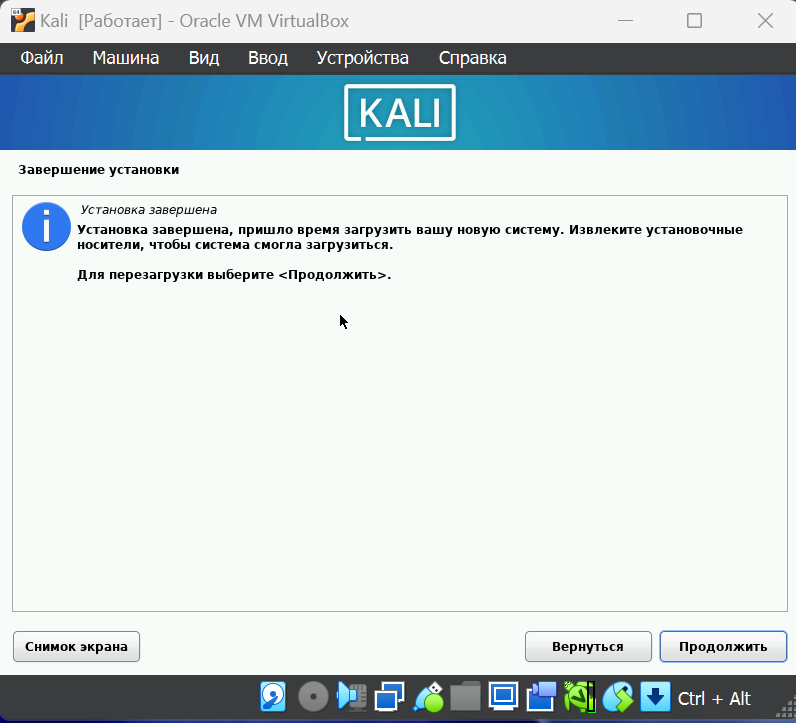
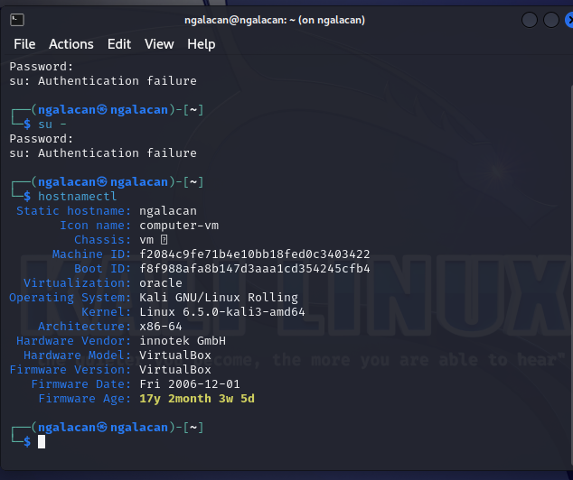

---
## Front matter
title: "Отчет по этапу №1"
subtitle: "Установка Kali Linux"
author: "Галацан Николай, НПИбд-01-22"

## Generic otions
lang: ru-RU
toc-title: "Содержание"

## Bibliography
bibliography: bib/cite.bib
csl: pandoc/csl/gost-r-7-0-5-2008-numeric.csl

## Pdf output format
toc: true # Table of contents
toc-depth: 2
lof: true # List of figures
fontsize: 12pt
linestretch: 1.5
papersize: a4
documentclass: scrreprt
## I18n polyglossia
polyglossia-lang:
  name: russian
  options:
	- spelling=modern
	- babelshorthands=true
polyglossia-otherlangs:
  name: english
## I18n babel
babel-lang: russian
babel-otherlangs: english
## Fonts
mainfont: PT Serif
romanfont: PT Serif
sansfont: PT Sans
monofont: PT Mono
mainfontoptions: Ligatures=TeX
romanfontoptions: Ligatures=TeX
sansfontoptions: Ligatures=TeX,Scale=MatchLowercase
monofontoptions: Scale=MatchLowercase,Scale=0.9
## Biblatex
biblatex: true
biblio-style: "gost-numeric"
biblatexoptions:
  - parentracker=true
  - backend=biber
  - hyperref=auto
  - language=auto
  - autolang=other*
  - citestyle=gost-numeric
## Pandoc-crossref LaTeX customization
figureTitle: "Рис."
tableTitle: "Таблица"
listingTitle: "Листинг"
lofTitle: "Список иллюстраций"
lotTitle: "Список таблиц"
lolTitle: "Листинги"
## Misc options
indent: true
header-includes:
  - \usepackage{indentfirst}
  - \usepackage{float} # keep figures where there are in the text
  - \floatplacement{figure}{H} # keep figures where there are in the text
---
# Цель работы

 Приобретение практических навыков установки ОС на виртуальную машину [@infosec].

# Выполнение лабораторной работы

В первую очередь, скачиваю образ ОС с официального сайта. Приступаю к созданию виртуальной машины. Указываю имя виртуальной машины, выбираю тип ОС и версию, указываю путь к iso-образу, а также проверяю корректность пути для папки машины (рис. [-@fig:1]).

{#fig:1 width=70%}

Указываю размер памяти (2048 МБ) и количество процессоров, задаю размер виртуального жесткого диска (40 ГБ) (рис. [-@fig:2]). Запускаю виртуальную машину, устанавливаю образ ОС, перейдя на соответствующую строку.

{#fig:2 width=70%}

Произвожу необходимые настройки: устанавливаю язык интерфейса, в окне, настраиваю раскладку клавиатуры, сеть и т.д. Создаю пользователя (рис. [-@fig:3]).

{#fig:3 width=70%}

После настройки всех разделов запускаю установку и дожидаюсь ее окончания (рис. [-@fig:4]). Перезапускаю систему и вхожу под заданной при установке учетной  записью.

{#fig:4 width=70%}

Открываю терминал и убеждаюсь, что система установлена успешно (рис. [-@fig:5]).

{#fig:5 width=70%}

# Выводы

Я приобрел практические навыки установки операционной системы на виртуальную машину. В ходе работы были настроены минимально необходимые для дальнейшей работы сервисы, установлено необходимое ПО.

# Список литературы{.unnumbered}

::: {#refs}
:::

