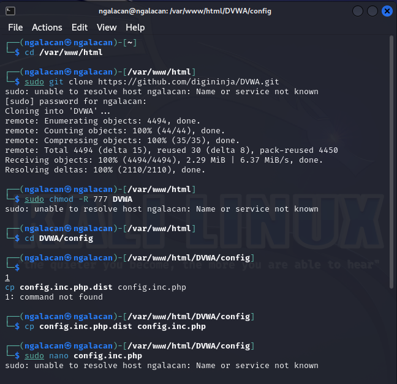
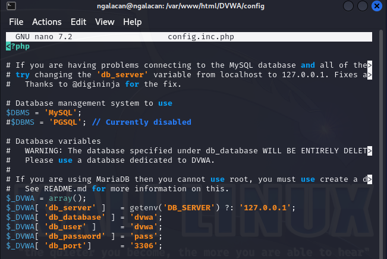
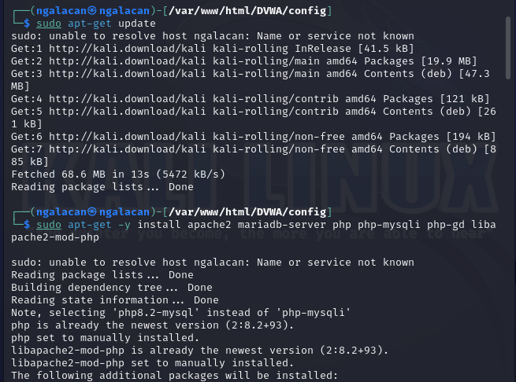
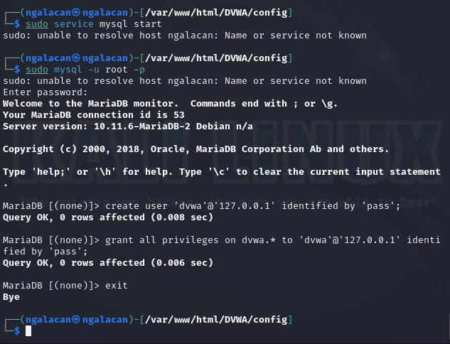
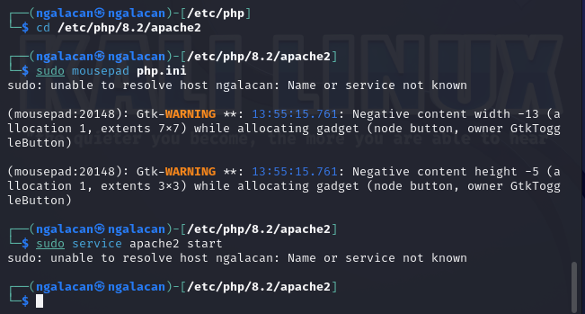
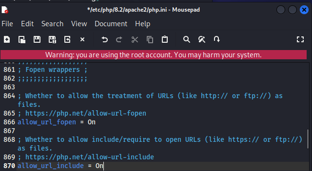
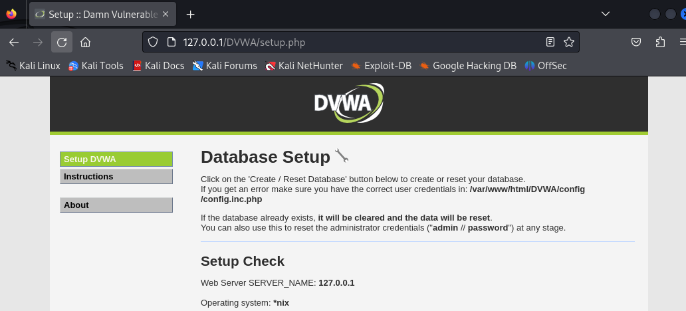
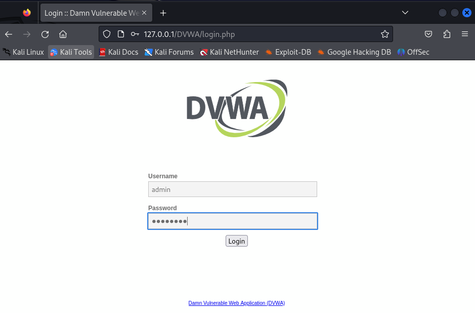
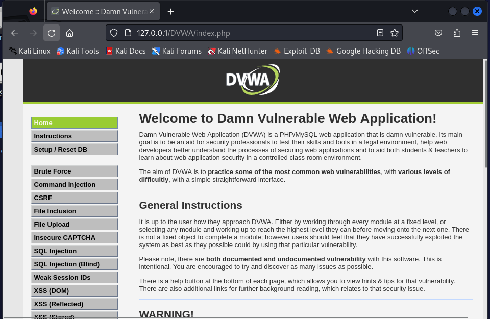

---
## Front matter
title: "Отчет по этапу №2"
subtitle: "Установка DVWA"
author: "Галацан Николай, НПИбд-01-22"

## Generic otions
lang: ru-RU
toc-title: "Содержание"

## Bibliography
bibliography: bib/cite.bib
csl: pandoc/csl/gost-r-7-0-5-2008-numeric.csl

## Pdf output format
toc: true # Table of contents
toc-depth: 2
lof: true # List of figures
fontsize: 12pt
linestretch: 1.5
papersize: a4
documentclass: scrreprt
## I18n polyglossia
polyglossia-lang:
  name: russian
  options:
	- spelling=modern
	- babelshorthands=true
polyglossia-otherlangs:
  name: english
## I18n babel
babel-lang: russian
babel-otherlangs: english
## Fonts
mainfont: PT Serif
romanfont: PT Serif
sansfont: PT Sans
monofont: PT Mono
mainfontoptions: Ligatures=TeX
romanfontoptions: Ligatures=TeX
sansfontoptions: Ligatures=TeX,Scale=MatchLowercase
monofontoptions: Scale=MatchLowercase,Scale=0.9
## Biblatex
biblatex: true
biblio-style: "gost-numeric"
biblatexoptions:
  - parentracker=true
  - backend=biber
  - hyperref=auto
  - language=auto
  - autolang=other*
  - citestyle=gost-numeric
## Pandoc-crossref LaTeX customization
figureTitle: "Рис."
tableTitle: "Таблица"
listingTitle: "Листинг"
lofTitle: "Список иллюстраций"
lotTitle: "Список таблиц"
lolTitle: "Листинги"
## Misc options
indent: true
header-includes:
  - \usepackage{indentfirst}
  - \usepackage{float} # keep figures where there are in the text
  - \floatplacement{figure}{H} # keep figures where there are in the text
---
# Цель работы

Установить DVWA в гостевую систему к Kali Linux.

# Выполнение лабораторной работы

Damn Vulnerable Web Application (DVWA) — это намеренно уязвимое веб-приложение на PHP/MySQL [@kali-linux].

Перехожу в каталог `/var/www/html` и клонирую репозиторий git

`https://github.com/digininja/DVWA.git`. 

Изменяю права доступа к папке установки. В каталоге установки перехожу к файлу конфигурации: `cd DVWA/config`. Копирую файл конфигурации и переименовываю его: `cp config.inc.php.dist config.inc.php` (рис. [-@fig:1]). Открываю файл настроек и изменяю пароль: `sudo nano config.inc.php` (рис. [-@fig:2]).

{#fig:1 width=70%}

{#fig:2 width=70%}

Устанавливаю mariadb для работы с базой данных (рис. [-@fig:3]).

{#fig:3 width=70%}

Запускаю базу данных и вхожу. Создаю пользователя базы данных и предоставляю все привилегии (рис. [-@fig:4]):
```
sudo service mysql start
sudo mysql -u root -p
	
create user 'dvwa'@'127.0.0.1' identified by 'pass';
grant all privileges on dvwa.* to 'dvwa'@'127.0.0.1' identified by 'pass';

```

{#fig:4 width=70%}

Перехожу к настройке сервера Apache (рис. [-@fig:5]). В файле `php.ini` включаю два параметра (рис. [-@fig:6]), после чего запускаю сервер.

{#fig:5 width=70%}

{#fig:6 width=70%}

После этого открываю в браузере DVWA, введя `127.0.0.1/DVWA/` (рис. [-@fig:7]).

{#fig:7 width=70%}

Прокрутив вниз, нажимаю **Create / Reset Database** для создания базы данных и попадаю на страницу входа (рис. [-@fig:8]).

{#fig:8 width=70%}

Осуществив вход, оказываюсь на основной странице веб-приложения (рис. [-@fig:9])  [@dvwa].

{#fig:9 width=70%}

# Выводы

Приобретены навыки установки и настройки намеренно уязвимого веб-приложения DVWA на Kali Linux.

# Список литературы{.unnumbered}

::: {#refs}
:::

