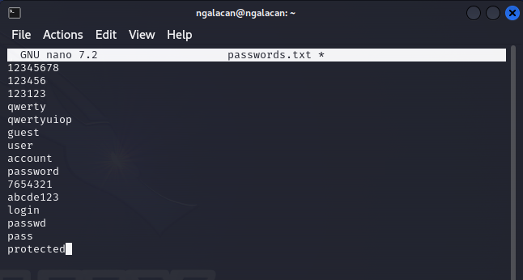

---
## Front matter
title: "Отчет по этапу №3"
subtitle: "Использование Hydra"
author: "Галацан Николай, НПИбд-01-22"

## Generic otions
lang: ru-RU
toc-title: "Содержание"

## Bibliography
bibliography: bib/cite.bib
csl: pandoc/csl/gost-r-7-0-5-2008-numeric.csl

## Pdf output format
toc: true # Table of contents
toc-depth: 2
lof: true # List of figures
fontsize: 12pt
linestretch: 1.5
papersize: a4
documentclass: scrreprt
## I18n polyglossia
polyglossia-lang:
  name: russian
  options:
	- spelling=modern
	- babelshorthands=true
polyglossia-otherlangs:
  name: english
## I18n babel
babel-lang: russian
babel-otherlangs: english
## Fonts
mainfont: PT Serif
romanfont: PT Serif
sansfont: PT Sans
monofont: PT Mono
mainfontoptions: Ligatures=TeX
romanfontoptions: Ligatures=TeX
sansfontoptions: Ligatures=TeX,Scale=MatchLowercase
monofontoptions: Scale=MatchLowercase,Scale=0.9
## Biblatex
biblatex: true
biblio-style: "gost-numeric"
biblatexoptions:
  - parentracker=true
  - backend=biber
  - hyperref=auto
  - language=auto
  - autolang=other*
  - citestyle=gost-numeric
## Pandoc-crossref LaTeX customization
figureTitle: "Рис."
tableTitle: "Таблица"
listingTitle: "Листинг"
lofTitle: "Список иллюстраций"
lotTitle: "Список таблиц"
lolTitle: "Листинги"
## Misc options
indent: true
header-includes:
  - \usepackage{indentfirst}
  - \usepackage{float} # keep figures where there are in the text
  - \floatplacement{figure}{H} # keep figures where there are in the text
---
# Цель работы

Научиться использовать инструмент Hydra для подбора имени пользователя и пароля.

# Выполнение лабораторной работы

Hydra — это инструмент, который можно использовать для подбора или взлома
имени пользователя и пароля. Инструмент поддерживает многочисленные сетевые протоколы, такие как HTTP, FTP, POP3 и SMB. Для работы ему нужны имя пользователя и пароль. Hydra пытается параллельно войти в сетевую службу и по
умолчанию для входа использует 16 подключений к целевой машине [@kali-linux].

Запускаю DVWA. Выставляю уровень безопасности на низкий (рис. [-@fig:1]). 

{#fig:1 width=70%}

Создаю файл `passwords.txt`, котором содержатся типичные и распространенные пароли (рис. [-@fig:2]).

{#fig:2 width=70%}

Открываю раздел Brute Force, в котором можно попытаться подобрать пароль для формы входа. Открываю код страницы и вижу, что данные отправляются методом GET, названия полей для ввода - username и password, кнопка для отправки имеет название Login (рис. [-@fig:3]).

{#fig:3 width=70%}

Для формирования запроса к hydra необходимо узнать PHPSESSID. Для этого нажимаю правой кнопкой мыши и выбираю Inspect. Во вкладке Storage нахожу ID сессии и данные cookie [@hydra-video] (рис. [-@fig:4]):

{#fig:4 width=70%}

Получив все необходимые данные, ввожу команду для запуска hydra (рис. [-@fig:5]).


```
hydra -l admin -P ~/passwords.txt 127.0.0.1 http-get-form 
'/DVWA/vulnerabilities/brute/:username=^USER^&password=^PASS^
&Login=Login:H=Cookie\:PHPSESSID=3r5rqa8jhh2r9cjsqmvojb2bq8;
security=low:F=Username and/or password incorrect'

```

где 

- `-l admin` - имя пользователя,
 
- `-P ~/passwords.txt` - список паролей для подбора, 

- `127.0.0.1` - адрес страницы, 

- `http-get-form` - указание, что данные отправляются методом GET,

- строка, в которой содержится путь к форме, имена заполняемых полей, ID сессии и сообщение об ошибке входа.

```
"/DVWA/vulnerabilities/brute/:username=^USER^&password=^PASS^
&Login=Login:H=Cookie\:PHPSESSID=3r5rqa8jhh2r9cjsqmvojb2bq8;
security=low:F=Username and/or password incorrect"
```

{#fig:5 width=70%}

Hydra удалось подобрать, что для входа от имени пользователя `admin` используется пароль `password`. Введя эти данные в форму, убеждаюсь, что пароль подобран верно (рис. [-@fig:6]).


{#fig:6 width=70%}

Теперь создаю файл с именами пользователей (рис. [-@fig:7]).

{#fig:7 width=70%}

Ввожу ту же самую команду для hydra, но заменив `-l admin` на `-L ~/users.txt`. Так мы указываем, что в файле `users.txt` содержатся возможные имена пользователя (рис. [-@fig:8]).

{#fig:8 width=70%}

На этот раз hydra смогла найти 2 комбинации для входа: `admin, password` и `Admin, password`, при этом действительны обе [@hydra].

# Выводы

Приобретены навыки использования hydra для подбора имени пользователя и пароля. Изучена уязвимость Brute Force в DVWA.

# Список литературы{.unnumbered}

::: {#refs}
:::

