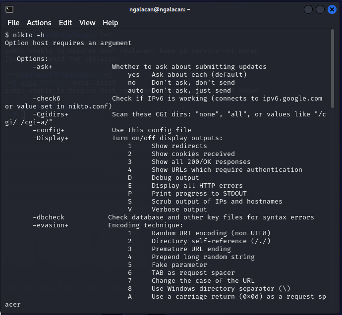
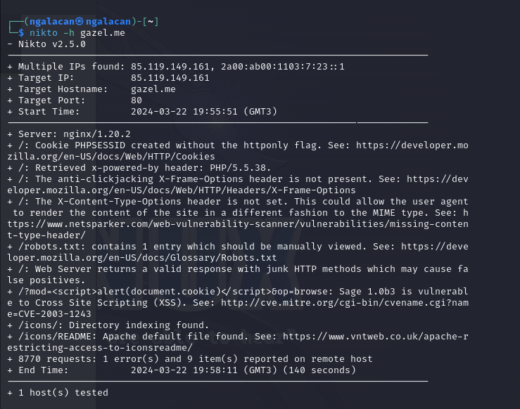
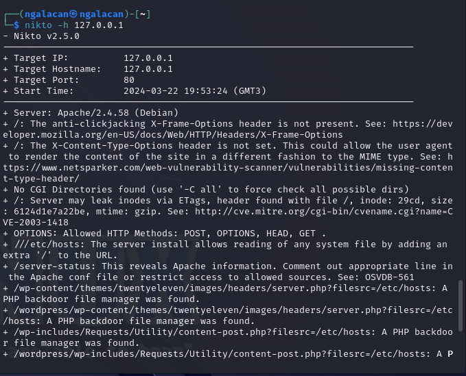
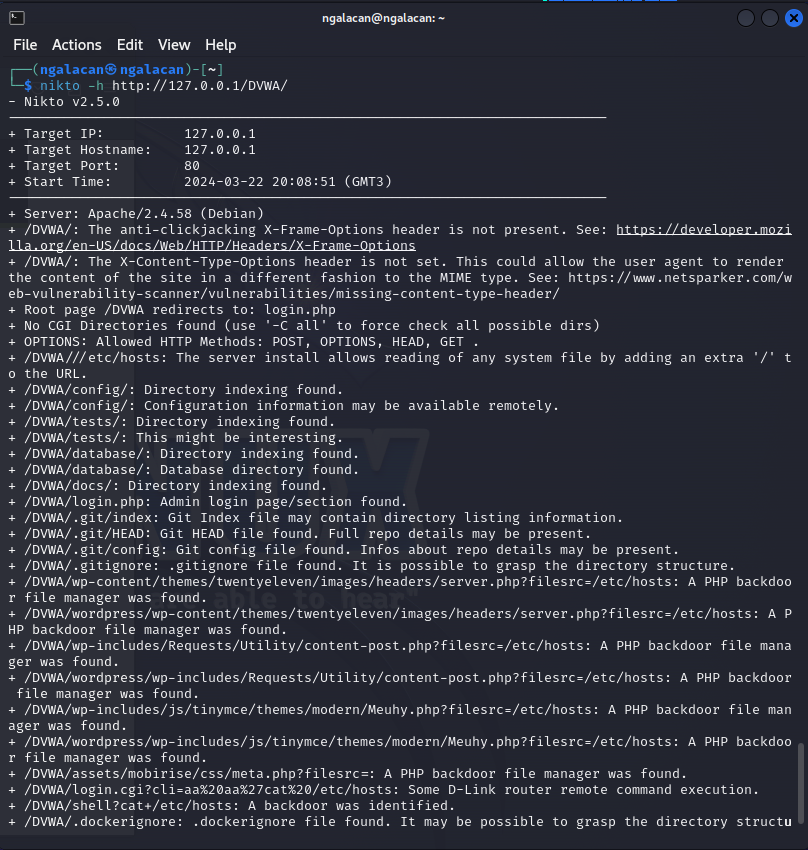

---
## Front matter
lang: ru-RU
title: Презентация по этапу №4
subtitle: Использование nikto
author:
  - Галацан Николай
institute:
  - Российский университет дружбы народов, Москва, Россия

## i18n babel
babel-lang: russian
babel-otherlangs: english

## Formatting pdf
toc: false
toc-title: Содержание
slide_level: 2
aspectratio: 169
section-titles: true
theme: metropolis
header-includes:
 - \metroset{progressbar=frametitle,sectionpage=progressbar,numbering=fraction}
 - '\makeatletter'
 - '\beamer@ignorenonframefalse'
 - '\makeatother'
---

## Докладчик

  * Галацан Николай
  * 1032225763
  * уч. группа: НПИбд-01-22
  * Факультет физико-математических и естественных наук
  * Российский университет дружбы народов

## Цели и задачи

Научиться использовать инструмент для сканирования на уязвимости nikto.

## Выполнение лабораторной работы

{#fig:1 width=50%}

## Выполнение лабораторной работы

{#fig:2 width=60%}

## Выполнение лабораторной работы

{#fig:3 width=60%}

## Выполнение лабораторной работы

{#fig:4 width=40%}

## Выводы

Приобретены навыки использования nikto для сканирования веб-серверов на уязвимости. Сканер nikto позволяет идентифицировать уязвимости веб-приложений, такие как раскрытие информации, инъекция (XSS/Script/HTML), удаленный поиск
файлов (на уровне сервера), выполнение команд и идентификация программного обеспечения.
