---
## Front matter
title: "Отчет по этапу №5"
subtitle: "Использование Burp Suite"
author: "Галацан Николай, НПИбд-01-22"

## Generic otions
lang: ru-RU
toc-title: "Содержание"

## Bibliography
bibliography: bib/cite.bib
csl: pandoc/csl/gost-r-7-0-5-2008-numeric.csl

## Pdf output format
toc: true # Table of contents
toc-depth: 2
lof: true # List of figures
fontsize: 12pt
linestretch: 1.5
papersize: a4
documentclass: scrreprt
## I18n polyglossia
polyglossia-lang:
  name: russian
  options:
	- spelling=modern
	- babelshorthands=true
polyglossia-otherlangs:
  name: english
## I18n babel
babel-lang: russian
babel-otherlangs: english
## Fonts
mainfont: PT Serif
romanfont: PT Serif
sansfont: PT Sans
monofont: PT Mono
mainfontoptions: Ligatures=TeX
romanfontoptions: Ligatures=TeX
sansfontoptions: Ligatures=TeX,Scale=MatchLowercase
monofontoptions: Scale=MatchLowercase,Scale=0.9
## Biblatex
biblatex: true
biblio-style: "gost-numeric"
biblatexoptions:
  - parentracker=true
  - backend=biber
  - hyperref=auto
  - language=auto
  - autolang=other*
  - citestyle=gost-numeric
## Pandoc-crossref LaTeX customization
figureTitle: "Рис."
tableTitle: "Таблица"
listingTitle: "Листинг"
lofTitle: "Список иллюстраций"
lotTitle: "Список таблиц"
lolTitle: "Листинги"
## Misc options
indent: true
header-includes:
  - \usepackage{indentfirst}
  - \usepackage{float} # keep figures where there are in the text
  - \floatplacement{figure}{H} # keep figures where there are in the text
---
# Цель работы

Научиться использовать Burp Suite для демонстрации реальных возможностей злоумышленника, проникающего в веб-приложения.

# Выполнение лабораторной работы

**Burp Suite** представляет собой набор мощных инструментов безопасности веб-приложений. Эти инструменты позволяют сканировать,
анализировать и использовать веб-приложения с помощью ручных и автоматических методов. [@kali-linux]

Для запуска Burn Suite выбираю команду меню *Applications -> Web Application Analysis -> burpsuite*
В нашем примере мы будем использовать Burp для взлома учетных данных, чтобы получить доступ к приложению DVWA. Для этого нам сначала потребуется настроить прокси-сервер и убедиться, что для IP установлено значение localhost IP, а номер порта — 8080.
Открываю вкладку *Proxy*. Нажимаю *Intercept is on* (рис. [-@fig:1]). 

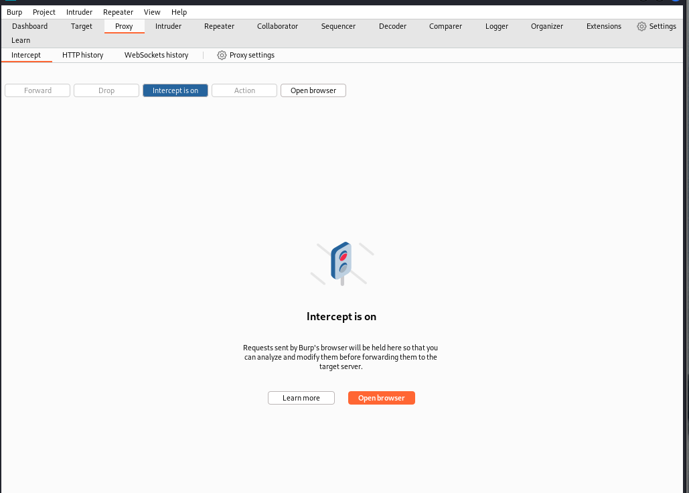{#fig:1 width=70%}

После этого открываю браузер и выбираю  *Settinfs -> Preferences -> Advanced -> Network -> Connection Settings* и настраиваю свой прокси-сервер. После этого запускаю и открываю DVWA (рис. [-@fig:2]).

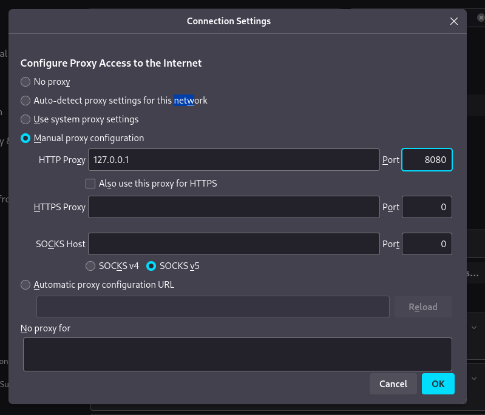{#fig:2 width=70%}

Перейдя в интерфейс Burp Suite, уже видны данные, которые программа смогла получить (рис. [-@fig:3]).

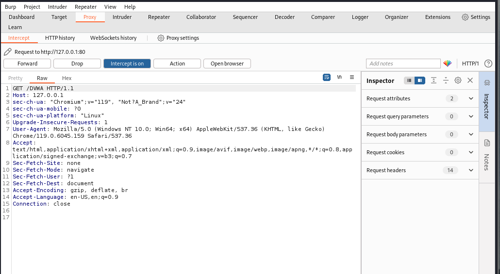{#fig:3 width=70%}

После нескольких нажатий кнопки *Forward* браузер загружает веб-страницу. В Burp Suite на вкладке *Target* (Цель) теперь видны некоторые данные на внутренней вкладке *Site map* (Карта сайта) (рис. [-@fig:4]).

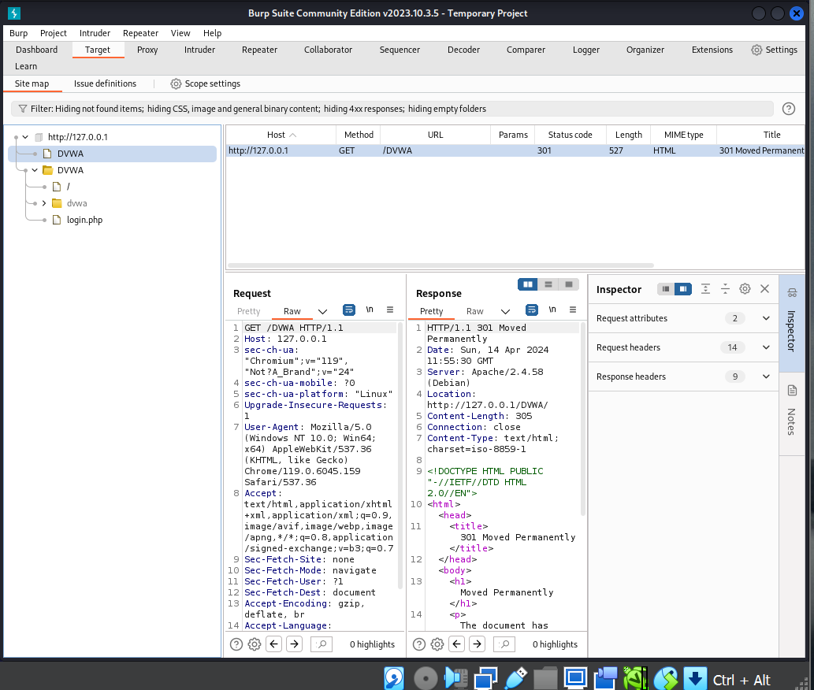{#fig:4 width=70%}

В браузере ввожу любые логин и пароль для входа. Во вкладке *Intercept* вижу перехваченный запрос, где на последней строке видны введенные логин и пароль (рис. [-@fig:5]).

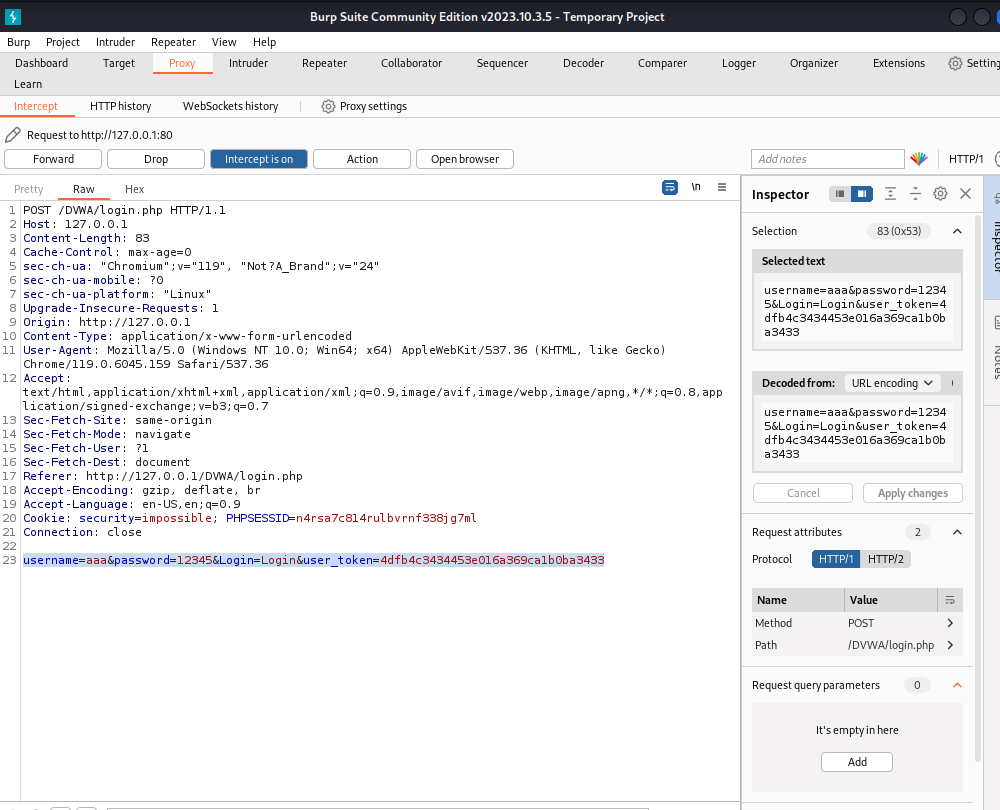{#fig:5 width=70%}

Во вкладке *HTTP-history* так же можно увидеть попытку входа. Нажимаю правой кнопкой мыши на запрос и выбираю *Send to Intruder* (рис. [-@fig:6])

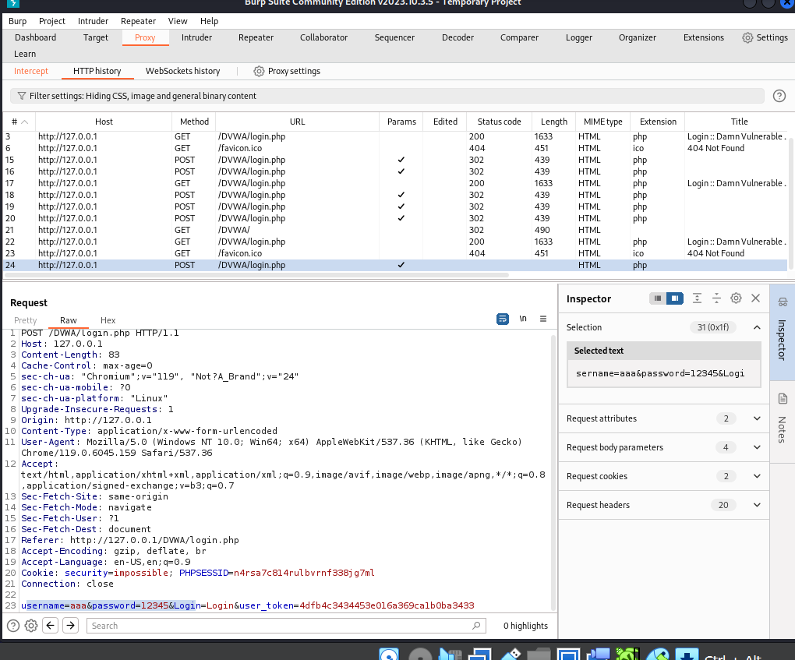{#fig:6 width=70%}

В разделе *Intruder* выбираю вкладку *Positions* и выделяю поля со введенными логином и паролем на последней строке, нажимаю *Add* (рис. [-@fig:7])

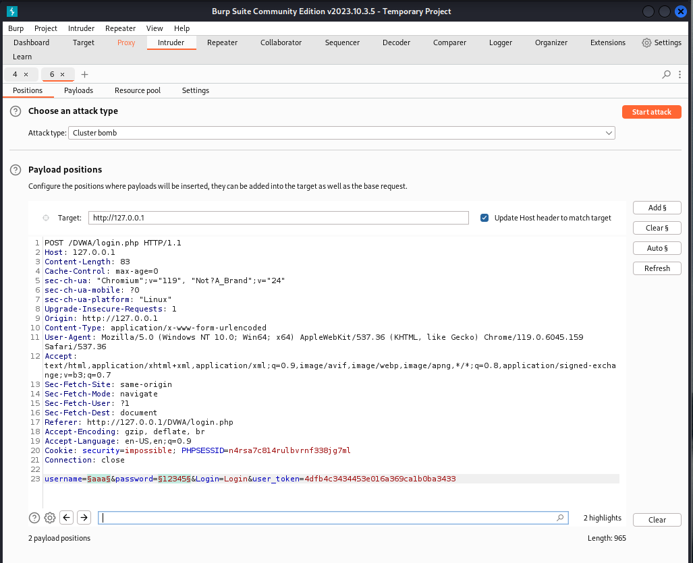{#fig:7 width=70%}

Выбираю тип атаки *Cluster bomb* и перехожу на вкладку *Payloads*. В *Payload sets* выбираю 1 и заполняю: в *Payload settings* прописываю возможные имена пользователя для подбора (рис. [-@fig:8])

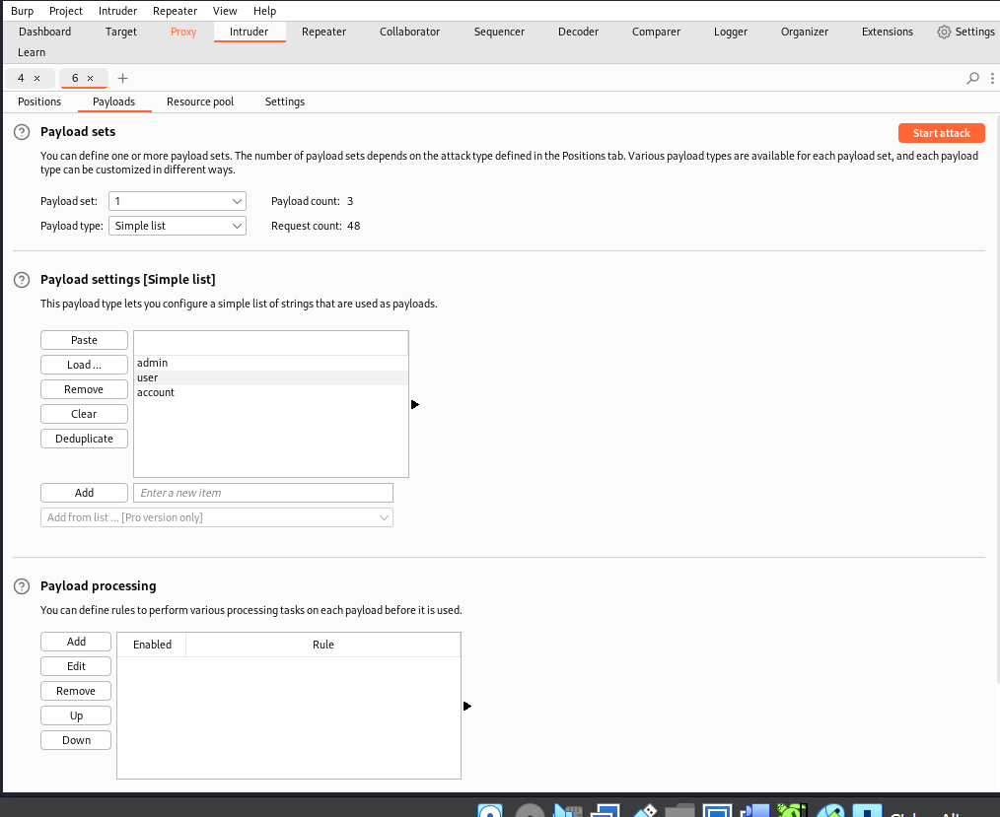{#fig:8 width=70%}

В *Payload sets* выбираю 2 и заполняю: в *Payload settings* добавляю возможные пароли (рис. [-@fig:9])

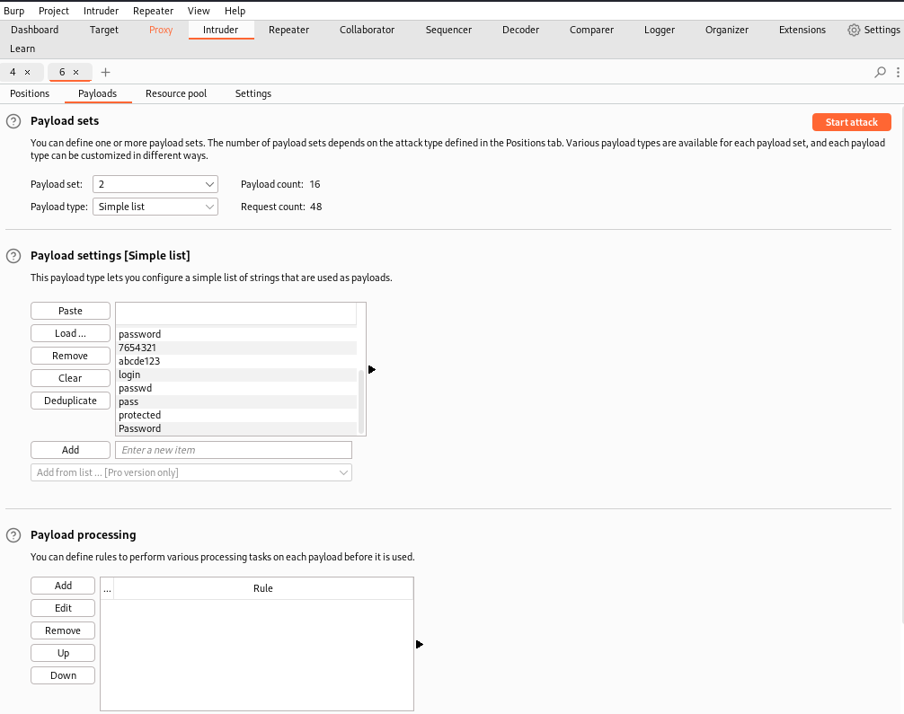{#fig:9 width=70%}

Нажимаю *Start attack* и дожидаюсь результатов (рис. [-@fig:10])

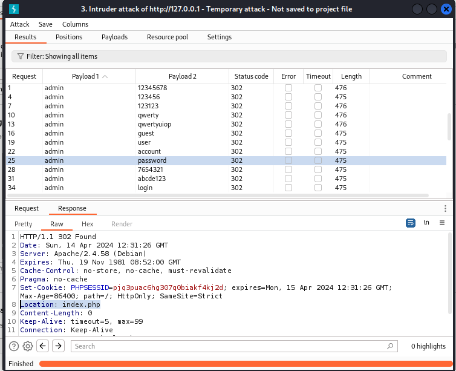{#fig:10 width=70%}

Все попытки атаки получили статус (код ответа HTTP) 302 - Перенаправление. Если нажать  кнопкой мыши на результате, а затем выбрать вкладку *Response* (Ответ), то можно увидеть, что все запросы перенаправляются на `login.php`, кроме одного. Это комбинация `admin:password`, который перенаправляется на `index.php`. Это и есть верные логин и пароль.

Нажав на запрос и выбрав *Send to Repeater*, можно проверить эти результаты в Burp Suite. Ретранслятор предназначен для ручного изменения HTTP-запросов и данных, отправляемых в этих запросах. Во влкадке *Repeater* можно изменять данные в запросе, нажать *Send* и получить ответ (рис. [-@fig:11]) [@kali-linux]

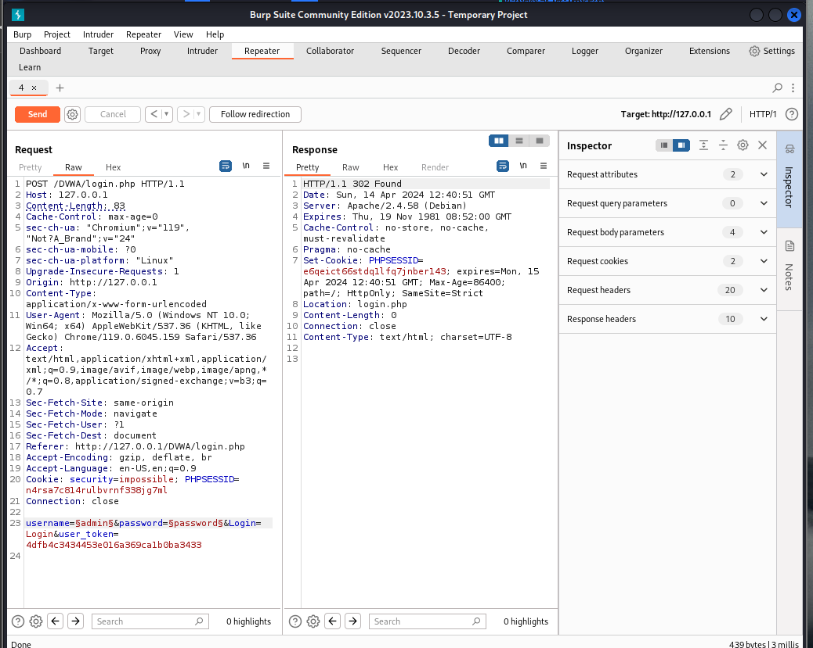{#fig:11 width=70%}

# Выводы

В ходе работы были изучены и использованы несколько инструментов, которые входят в состав Burp Suite. Этот набор инструментов безопасности приложений является мощной платформой для атаки веб-приложений. [@kali-linux]

# Список литературы{.unnumbered}

::: {#refs}
:::

